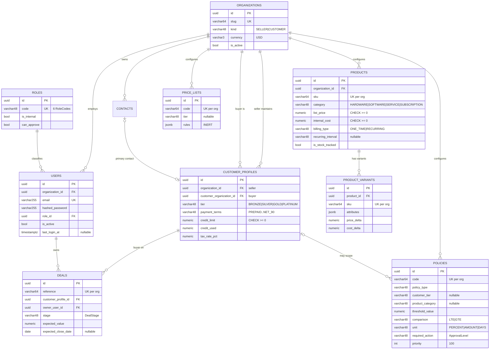
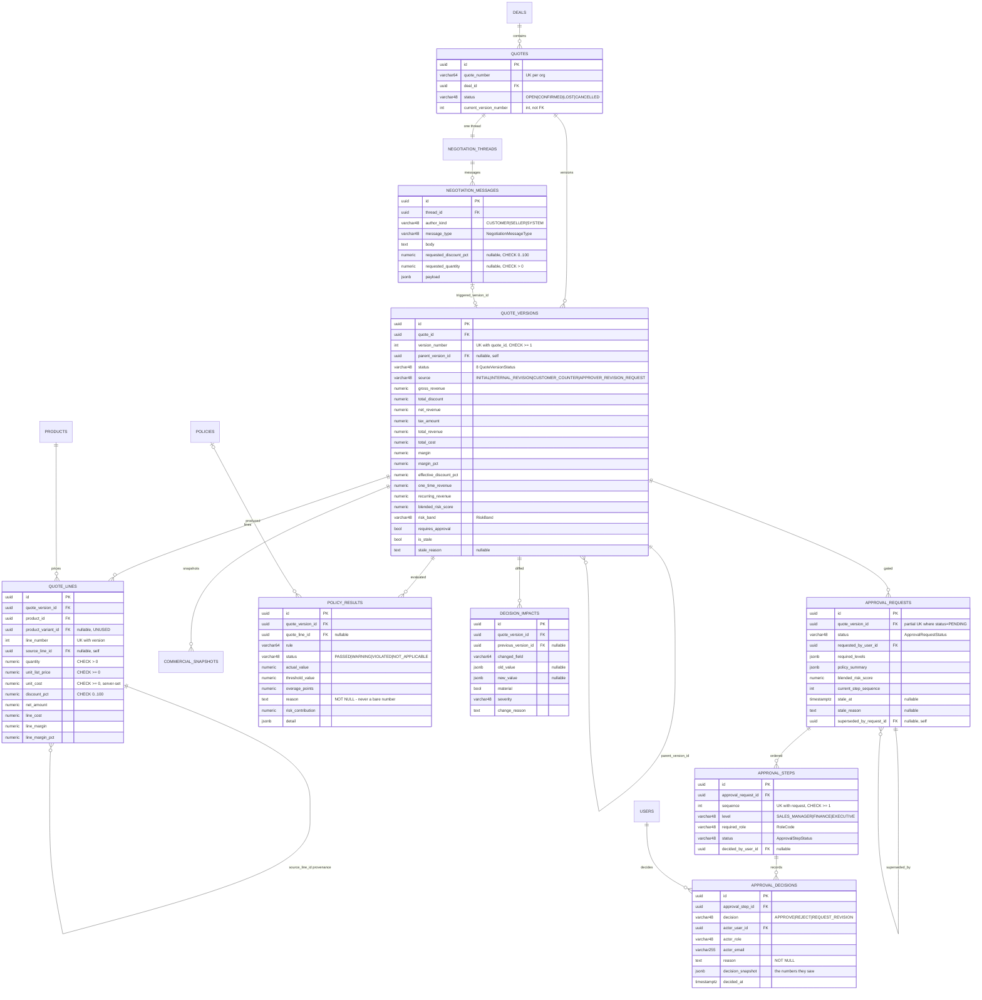
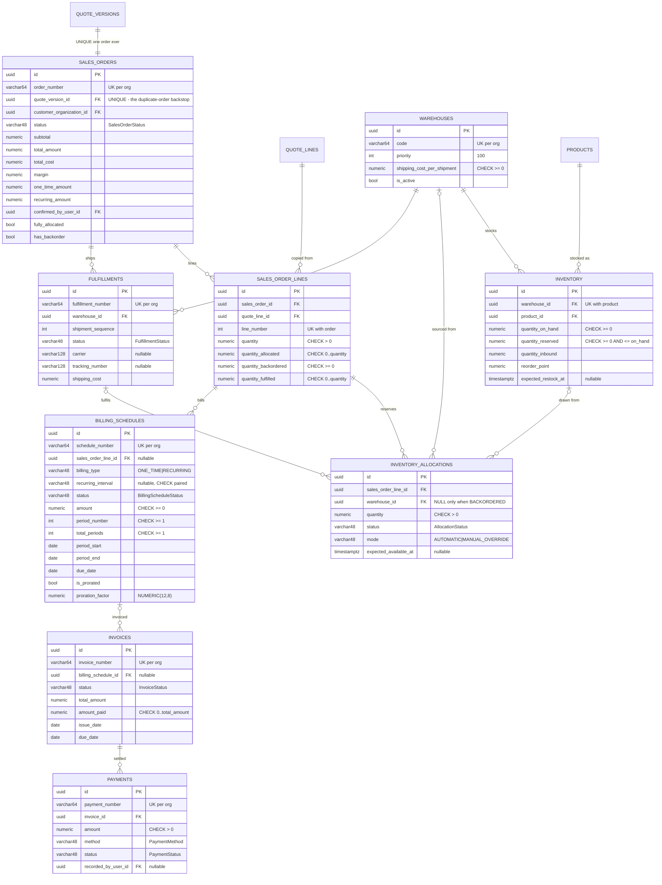
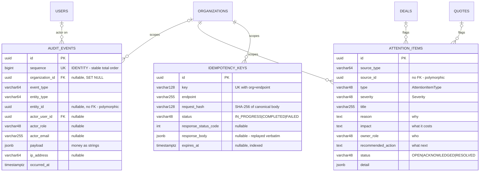

# DATA MODEL

33 tables in PostgreSQL 16. Verified against [`app/models/`](../app/models/),
the `EXPECTED_TABLES` constant in [`app/models/__init__.py`](../app/models/__init__.py),
and migrations `91563b112f87` (initial, 33 tables) and `26bdcb293597`
(`quote_lines.source_line_id`).

`python -m scripts.verify_db` asserts: 33 tables, 112 foreign keys across 31
tables, 645 constraints, 205 indexes, **zero float/double columns** (95 NUMERIC
money columns), and all timestamps timezone-aware.

---

## 1. Column type conventions

Defined in [`app/models/base.py`](../app/models/base.py).

| Alias | SQL type | Used for |
|---|---|---|
| `Money` | `NUMERIC(18, 2)` | Amounts and totals |
| `UnitMoney` | `NUMERIC(18, 4)` | Unit prices and costs |
| `Percent` | `NUMERIC(9, 4)` | Percentages and risk scores |
| `Quantity` | `NUMERIC(18, 4)` | Quantities |
| `Factor` | `NUMERIC(12, 8)` | Proration factors |
| `Str32/64/128/255` | `VARCHAR(n)` | Bounded strings |
| `LongText` | `TEXT` | Reasons, notes, explanations |
| `JsonDict` / `JsonList` | `JSONB` | Structured payloads |

**No floating-point column exists anywhere.** A margin decision cannot rest on
IEEE-754 drift.

### Mixins

| Mixin | Adds |
|---|---|
| `UUIDPrimaryKeyMixin` | `id UUID PRIMARY KEY DEFAULT uuid4` |
| `TimestampMixin` | `created_at TIMESTAMPTZ NOT NULL` (indexed), `updated_at TIMESTAMPTZ NOT NULL` with Python-side `onupdate` |
| `CreatedAtMixin` | `created_at` only — used by append-only tables so there is nothing to rewrite history with |
| `OrgOwnedMixin` | `organization_id UUID NOT NULL REFERENCES organizations(id) ON DELETE RESTRICT` (indexed) |

`updated_at` uses a Python-side `onupdate` rather than a SQL expression: a
SQL-expression `onupdate` forces a post-fetch that leaves the attribute expired,
and the next read then attempts sync IO and raises `MissingGreenlet` on an
`AsyncSession`.

### Enum storage

Every enum column is `VARCHAR(48)` plus a named `CHECK` constraint
(`native_enum=False`), not a PostgreSQL `ENUM` type. Values stay readable in
`psql` and adding one never requires `ALTER TYPE` in a migration.

---

## 2. Relationships in plain English

```
Organization (SELLER)
 ├── owns → Users ── has → Role
 ├── configures → Products ── has → ProductVariants
 ├── configures → PriceLists
 ├── configures → Policies              (discount ceilings, margin floor, signing authority)
 ├── configures → Warehouses ── stocks → Inventory
 └── maintains → CustomerProfiles ── point at → Organization (CUSTOMER)
                  ├── has → Contacts
                  └── is the buyer on → Deals

Deal (owned by a User)
 └── contains → Quotes
                 └── contains → QuoteVersions        (immutable once submitted)
                                 ├── parent_version_id → itself      (revision chain)
                                 ├── contains → QuoteLines
                                 │                └── source_line_id → itself  (provenance)
                                 ├── measured by → CommercialSnapshot
                                 ├── judged by → PolicyResults
                                 ├── diffed into → DecisionImpacts
                                 ├── gated by → ApprovalRequest
                                 │                ├── ordered → ApprovalSteps
                                 │                ├── records → ApprovalDecisions
                                 │                └── superseded_by_request_id → itself
                                 ├── discussed in → NegotiationThread → NegotiationMessages
                                 └── becomes → SalesOrder            (exactly one, ever)

SalesOrder
 ├── contains → SalesOrderLines
 │                └── reserved by → InventoryAllocations → Inventory / Warehouse
 ├── shipped as → Fulfillments        (one per warehouse)
 └── billed by → BillingSchedules
                  └── invoiced as → Invoices
                                     └── settled by → Payments

Everything                     → AuditEvents        (append-only, monotonic sequence)
Anything needing attention     → AttentionItems     (why, impact, owner, next action)
Retryable POSTs                → IdempotencyKeys
```

**The three self-referential links carry the governance semantics:**

| Link | Purpose |
|---|---|
| `quote_versions.parent_version_id` | The revision chain. Lets you walk back to the terms that were originally approved. |
| `quote_lines.source_line_id` | Line **provenance**. Matching lines by position would report an add-plus-remove as an innocuous product swap, hiding a real scope change from the approver. |
| `approval_requests.superseded_by_request_id` | Links a stale decision to the one that replaced it, so "who approved this, and was that still valid?" is answerable. |

---

## 3. Entity relationship diagram — identity and commercial



---

## 4. Entity relationship diagram — quotes and governance



---

## 5. Entity relationship diagram — execution and billing



---

## 6. System tables



`audit_events` has **no `updated_at`** — it uses `CreatedAtMixin`. There is
structurally nothing to rewrite history with. Its `organization_id` is nullable
with `ON DELETE SET NULL` so the trail outlives the tenant.

---

## 7. Constraint inventory that enforces business rules

The database is the last line of defence. These constraints mean an application
bug produces a failed transaction, not corrupt commercial data.

| Constraint | Table | Guarantees |
|---|---|---|
| `UNIQUE (quote_version_id)` | `sales_orders` | **One order per quote version, ever.** The duplicate-confirmation backstop above the idempotency layer. |
| `CHECK (quantity_reserved <= quantity_on_hand)` | `inventory` | **Inventory can never be over-allocated**, even with a bug in `InventoryService`. |
| Partial `UNIQUE (quote_version_id) WHERE status='PENDING'` | `approval_requests` | At most one open approval per version. |
| Partial `UNIQUE (org, source_type, source_id, type) WHERE status<>'RESOLVED'` | `attention_items` | One live item per source, so re-evaluation refreshes rather than spams the Control Tower. |
| `CHECK ((status='BACKORDERED' AND warehouse_id IS NULL) OR (status<>'BACKORDERED' AND warehouse_id IS NOT NULL))` | `inventory_allocations` | A backorder has no warehouse; a reservation always does. |
| `CHECK ((billing_type='RECURRING' AND recurring_interval IS NOT NULL) OR (billing_type='ONE_TIME' AND recurring_interval IS NULL))` | `billing_schedules` | Recurring implies an interval. |
| `CHECK (quantity_allocated >= 0 AND <= quantity)` | `sales_order_lines` | Cannot allocate more than ordered. |
| `CHECK (quantity_fulfilled >= 0 AND <= quantity)` | `sales_order_lines` | Cannot ship more than ordered. |
| `CHECK (amount_paid >= 0 AND <= total_amount)` | `invoices` | No overpayment at the storage layer. |
| `CHECK (discount_pct >= 0 AND <= 100)` | `quote_lines` | Discount is a real percentage. |
| `CHECK (quantity > 0)` | `quote_lines`, `sales_order_lines`, `inventory_allocations` | No zero or negative line. |
| `CHECK (version_number >= 1)` | `quote_versions` | Versions start at 1. |
| `UNIQUE (quote_id, version_number)` | `quote_versions` | No duplicate version numbers. |
| `UNIQUE (quote_version_id, line_number)` | `quote_lines` | Stable line numbering. |
| `UNIQUE (approval_request_id, sequence)` | `approval_steps` | Ordered steps, no ties. |
| `UNIQUE (warehouse_id, product_id)` | `inventory` | One stock row per pair. |
| `UNIQUE (organization_id, <natural key>)` | products, policies, warehouses, deals, quotes, orders, price_lists, variants, fulfillments, schedules, payments | Tenant-scoped natural keys. |
| `ON DELETE RESTRICT` | commercial FKs (products, users, profiles on orders) | Cannot delete a product that has been sold. |
| `ON DELETE CASCADE` | version → lines, request → steps, order → lines | Child rows follow their parent. |
| `ON DELETE SET NULL` | self-refs, optional FKs, audit actor | History survives deletion of the referent. |

---

## 8. JSONB payload shapes

17 JSONB columns. Shapes are inferred from the services that write them.

### `commercial_snapshots.snapshot_json`

Written by `CommercialEngine.calculate_version`, then merged with risk data by
`PolicyEngine`. All money and percentage values are **strings**.

```json
{
  "version_number": 1,
  "status": "DRAFT",
  "currency": "USD",
  "line_count": 4,
  "lines": [
    {
      "quote_line_id": "uuid", "product_id": "uuid", "line_number": 1,
      "description": "Business Laptop", "category": "HARDWARE",
      "quantity": "100.0000", "unit_list_price": "1200.0000",
      "unit_cost": "800.0000", "unit_net_price": "984.0000",
      "discount_pct": "18.0000", "gross_amount": "120000.00",
      "discount_amount": "21600.00", "net_amount": "98400.00",
      "tax_amount": "0.00", "total_amount": "98400.00",
      "line_cost": "80000.00", "line_margin": "18400.00",
      "line_margin_pct": "18.6992", "billing_type": "ONE_TIME",
      "recurring_interval": null, "recurring_periods": 1
    }
  ],
  "totals": {
    "gross_revenue": "160800.00", "total_discount": "28090.00",
    "net_revenue": "132710.00", "tax_amount": "0.00",
    "total_revenue": "132710.00", "total_cost": "100200.00",
    "margin": "32510.00", "margin_pct": "24.4970",
    "effective_discount_pct": "17.4689",
    "one_time_revenue": "132410.00", "recurring_revenue": "300.00"
  },
  "blended_risk": { "score": "32.4443", "band": "MEDIUM", "components": [] },
  "policy_violations": [],
  "required_approvals": []
}
```

### `approval_requests.required_levels`

```json
[
  { "type": "SALES_MANAGER", "reason": "...", "triggered_by": ["CATEGORY_DISCOUNT_CEILING"] },
  { "type": "FINANCE", "reason": "...", "triggered_by": ["DISCOUNT-AUTHORITY-20K"] }
]
```

### `approval_requests.policy_summary`

```json
{
  "violation_count": 3,
  "blended_risk": { "score": "32.4443", "band": "MEDIUM", "components": [], "formula": "...", "explanation": "..." },
  "required_approvals": [],
  "violations": []
}
```

### `approval_decisions.decision_snapshot`

The numbers the approver was actually looking at.

```json
{
  "version_number": 1, "total_revenue": "132710.00", "net_revenue": "132710.00",
  "total_cost": "100200.00", "margin": "32510.00", "margin_pct": "24.4970",
  "total_discount": "28090.00", "blended_risk_score": "32.4443", "risk_band": "MEDIUM"
}
```

### `policy_results.detail`

Varies by rule. Examples: `{"line_number": 3}`,
`{"policy_code": "GOLD-SV-CEILING"}`,
`{"margin_amount": "32510.00", "net_revenue": "132710.00"}`.

### `negotiation_messages.payload`

For `COUNTER_OFFER` / `CHANGE_REQUEST`:

```json
{
  "requested_lines": [
    {
      "quote_line_id": "uuid", "description": "Business Laptop",
      "current_discount_pct": "18.0000", "requested_discount_pct": "25.0000",
      "current_quantity": "100.0000", "requested_quantity": null
    }
  ]
}
```

### `decision_impacts.old_value` / `new_value`

Arbitrary JSON scalars for field-level diffs: `"18.0000"` → `"25.0000"`,
or `null` when a line was added or removed.

### `attention_items.detail`

Context for deep-linking: `quote_version_id`, `message_id`, `new_version_id`,
`shortfall`, margin violation figures.

### `billing_schedules.detail`

`{"quantity": "1.0000", "unit_net_price": "300.0000", "category": "SUBSCRIPTION", "interval_months": 12}`

### `audit_events.payload`

Event-specific. Keys prefixed with `_` (`_actor_email`, `_actor_role`,
`_ip_address`) are consumed by the audit writer and **stripped** from the stored
payload. Money is always a string.

### `product_variants.attributes` · `price_lists.rules` · `policies.config` · `idempotency_keys.response_body`

| Column | Shape |
|---|---|
| `product_variants.attributes` | Free-form, e.g. `{"size": "15-inch", "pack": 1}` |
| `price_lists.rules` | `[{"product_id": "uuid", "unit_price": "1100.00"}]` — **written but never read** |
| `policies.config` | Extensible dict, default `{}`; no fixed schema |
| `idempotency_keys.response_body` | The full cached HTTP response body, replayed verbatim |

---

## 9. Table inventory

| # | Table | Group | Mixins | Notes |
|---|---|---|---|---|
| 1 | `organizations` | Identity | UUID + Timestamp | No `organization_id`; `kind` SELLER/CUSTOMER |
| 2 | `roles` | Identity | UUID + Timestamp | Global, not tenant-scoped |
| 3 | `users` | Identity | UUID + OrgOwned + Timestamp | `email` globally unique |
| 4 | `contacts` | Identity | UUID + OrgOwned + Timestamp | Unique `(org, email)` |
| 5 | `customer_profiles` | Commercial | UUID + OrgOwned + Timestamp | Bridges seller org ↔ buyer org |
| 6 | `products` | Commercial | UUID + OrgOwned + Timestamp | |
| 7 | `product_variants` | Commercial | UUID + OrgOwned + Timestamp | Not usable in quoting |
| 8 | `price_lists` | Commercial | UUID + OrgOwned + Timestamp | Inert |
| 9 | `deals` | Commercial | UUID + OrgOwned + Timestamp | |
| 10 | `quotes` | Quotes | UUID + OrgOwned + Timestamp | `current_version_number` is an int, not an FK, to avoid a circular FK |
| 11 | `quote_versions` | Quotes | UUID + OrgOwned + Timestamp | Self-FK `parent_version_id` |
| 12 | `quote_lines` | Quotes | UUID + OrgOwned + Timestamp | Self-FK `source_line_id` |
| 13 | `policies` | Governance | UUID + OrgOwned + Timestamp | |
| 14 | `policy_results` | Governance | UUID + OrgOwned + Timestamp | `reason` is NOT NULL |
| 15 | `commercial_snapshots` | Governance | UUID + OrgOwned + Timestamp | One `is_current` per version |
| 16 | `approval_requests` | Approvals | UUID + OrgOwned + Timestamp | Self-FK `superseded_by_request_id` |
| 17 | `approval_steps` | Approvals | UUID + OrgOwned + Timestamp | |
| 18 | `approval_decisions` | Approvals | UUID + OrgOwned + **CreatedAt** | Append-only |
| 19 | `decision_impacts` | Tracking | UUID + OrgOwned + **CreatedAt** | Append-only; stores non-material diffs too |
| 20 | `attention_items` | Tracking | UUID + OrgOwned + Timestamp | Polymorphic `source_id` |
| 21 | `negotiation_threads` | Negotiation | UUID + OrgOwned + Timestamp | Unique on `quote_id` |
| 22 | `negotiation_messages` | Negotiation | UUID + OrgOwned + **CreatedAt** | Append-only |
| 23 | `sales_orders` | Execution | UUID + OrgOwned + Timestamp | Unique `quote_version_id` |
| 24 | `sales_order_lines` | Execution | UUID + OrgOwned + Timestamp | |
| 25 | `fulfillments` | Execution | UUID + OrgOwned + Timestamp | One per warehouse |
| 26 | `warehouses` | Inventory | UUID + OrgOwned + Timestamp | |
| 27 | `inventory` | Inventory | UUID + OrgOwned + Timestamp | Unique `(warehouse, product)` |
| 28 | `inventory_allocations` | Inventory | UUID + OrgOwned + Timestamp | |
| 29 | `billing_schedules` | Billing | UUID + OrgOwned + Timestamp | |
| 30 | `invoices` | Billing | UUID + OrgOwned + Timestamp | |
| 31 | `payments` | Billing | UUID + OrgOwned + Timestamp | |
| 32 | `audit_events` | System | UUID + **CreatedAt** | **Not** OrgOwned — nullable org, SET NULL |
| 33 | `idempotency_keys` | System | UUID + OrgOwned + Timestamp | |

---

## 10. Computed properties (no DB column)

| Model | Property | Expression |
|---|---|---|
| `Organization` | `is_seller` | `kind == SELLER` |
| `User` | `role_code`, `is_internal` | from joined `Role` |
| `Contact` | `display_name` | first + last name |
| `CustomerProfile` | `credit_available` | `credit_limit - credit_used` |
| `CustomerProfile` | `payment_terms_days` | `PaymentTerms` → int |
| `Product` | `unit_margin` | `list_price - internal_cost` |
| `Policy` | `specificity` | score from scope columns; most specific policy wins |
| `QuoteVersion` | `is_editable` | `status in {DRAFT}` |
| `QuoteVersion` | `is_revisable` | `status in REVISABLE_VERSION_STATUSES` |
| `QuoteVersion` | `is_terminal` | `status in {CONFIRMED, REJECTED, SUPERSEDED}` |
| `ApprovalRequest` / `ApprovalStep` | `is_open` | `status == PENDING` |
| `Inventory` | `quantity_available` | `quantity_on_hand - quantity_reserved` |
| `SalesOrderLine` | `quantity_outstanding` | `quantity - quantity_allocated` |
| `Invoice` | `amount_due` | `total_amount - amount_paid` |

No `hybrid_property` and no `@validates` hooks exist. Only 8 `relationship()`
definitions exist, all unidirectional with no cascade — loading is explicit,
which keeps async query behaviour predictable.

---

## 11. Data model gaps

| # | Gap | Impact | Priority |
|---|---|---|---|
| 1 | No `sales_teams` table | PDF A7's "Sales Team / Rep" report filter has nothing to filter on | P0 |
| 2 | No `credit_notes` table | PDF A5/B7 partial refund and credit note cannot be represented | P0 |
| 3 | No per-organization settings table | PDF A3 approval chain and B9 stalled window must be configurable per tenant; both are currently process-global | P0 |
| 4 | No rep discount baseline storage | PDF B9 anomaly detection needs a rolling per-rep average | P0 |
| 5 | No delivery promise date on orders or fulfillments | PDF B9 slippage indicator has nothing to measure against | P0 |
| 6 | No order-level discount column on `quote_versions` | PDF B3 requires line **or order** level discounts | P0 |
| 7 | `quote_lines.product_variant_id` unreachable | `QuoteLineCreate` has no such field, so variants can never be attached | P1 |
| 8 | `price_lists.rules` never read | Tier pricing is inert | P1 |
| 9 | No `is_promoted` on products | PDF B5 promotion tag cannot be rendered | P1 |
| 10 | No dismissed-recommendation storage | PDF B5 Dismiss does not persist | P1 |
| 11 | `inventory` unique on `(warehouse, product)` only | Variant-level stock is not modelled, though `product_variant_id` exists on the row | P2 |
| 12 | `idempotency_keys.expires_at` written but never pruned | Table grows without bound | P3 |
