# ENTITY STATE LIFECYCLES

Every state machine below reflects the actual guards in
[`app/services/`](../app/services/) and the frozensets in
[`app/enums.py`](../app/enums.py). Invalid transitions list the exact error code
a client receives, so the frontend can map each one to a recovery action.

---

## Index

| Entity | States | Terminal states | Section |
|---|---|---|---|
| `QuoteVersion` | 8 | `CONFIRMED` `REJECTED` `SUPERSEDED` | [§1](#1-quoteversion) |
| `Quote` | 4 | `CONFIRMED` `LOST` `CANCELLED` | [§2](#2-quote) |
| `ApprovalRequest` | 6 | `APPROVED` `REJECTED` `REVISION_REQUESTED` `STALE` `CANCELLED` | [§3](#3-approvalrequest) |
| `ApprovalStep` | 6 | `APPROVED` `REJECTED` `REVISION_REQUESTED` `SKIPPED` `STALE` | [§4](#4-approvalstep) |
| `Deal` | 5 | `CLOSED_WON` `CLOSED_LOST` | [§5](#5-deal) |
| `NegotiationThread` | 5 | `RESOLVED` `CLOSED` | [§6](#6-negotiationthread) |
| `SalesOrder` | 7 | `FULFILLED` `CANCELLED` | [§7](#7-salesorder) |
| `InventoryAllocation` | 6 | `SHIPPED` `RELEASED` `CANCELLED` | [§8](#8-inventoryallocation) |
| `Fulfillment` | 5 | `DELIVERED` `CANCELLED` | [§9](#9-fulfillment) |
| `BillingSchedule` | 5 | `COMPLETED` `CANCELLED` | [§10](#10-billingschedule) |
| `Invoice` | 6 | `PAID` `VOID` | [§11](#11-invoice) |
| `Payment` | 4 | `SETTLED` `FAILED` `REFUNDED` | [§12](#12-payment) |
| `AttentionItem` | 3 | `RESOLVED` | [§13](#13-attentionitem) |
| `IdempotencyKey` | 3 | `COMPLETED` | [§14](#14-idempotencykey) |

---

## 1. QuoteVersion

The central state machine. Immutability is enforced in
`QuoteService.assert_editable`, which the routers call **and** which the mutation
methods call, so an alternate code path cannot bypass it. All 21 state ×
operation combinations are tested.

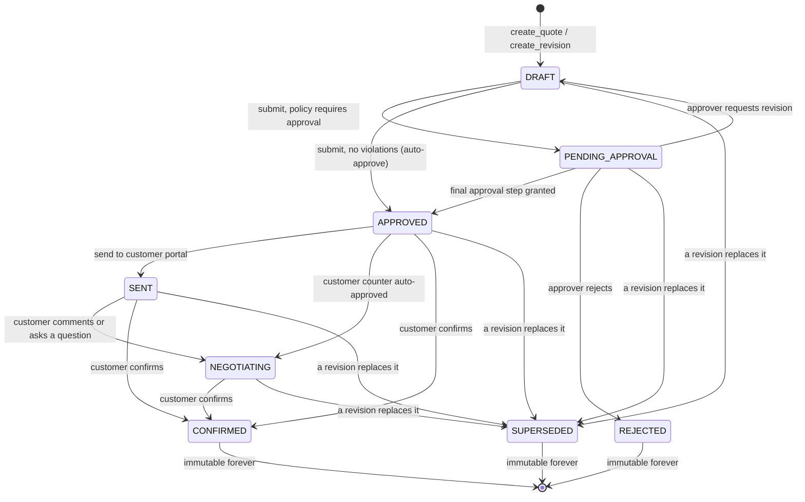

### Editability matrix

| State | Edit lines in place? | Revisable? | What to do instead |
|---|---|---|---|
| `DRAFT` | Yes | Yes | `PATCH`/`DELETE` directly |
| `PENDING_APPROVAL` | No | Yes | Create a revision |
| `APPROVED` | No | Yes | Create a revision → staleness check |
| `SENT` | No | Yes | Create a revision → staleness check |
| `NEGOTIATING` | No | Yes | Create a revision → staleness check |
| `CONFIRMED` | **Never** | **Never** | Start a new quote |
| `REJECTED` | **Never** | **Never** | Start a new quote |
| `SUPERSEDED` | **Never** | **Never** | Work on the successor version |

Backed by `EDITABLE_VERSION_STATUSES = {DRAFT}`,
`REVISABLE_VERSION_STATUSES = {DRAFT, PENDING_APPROVAL, APPROVED, SENT, NEGOTIATING}`,
`TERMINAL_VERSION_STATUSES = {CONFIRMED, REJECTED, SUPERSEDED}`.

### Who can trigger each transition

| Transition | Roles | Endpoint |
|---|---|---|
| `→ DRAFT` (create) | `SALES` `MANAGER` `ADMIN` | `POST /deals/{id}/quotes` |
| `DRAFT → PENDING_APPROVAL` / `APPROVED` | `SALES` `MANAGER` `ADMIN` | `POST /quote-versions/{id}/submit` |
| `PENDING_APPROVAL → APPROVED` / `REJECTED` / `DRAFT` | `MANAGER` `FINANCE` `ADMIN` (step role must match; not the author) | `POST /approvals/{id}/{approve,reject,request-revision}` |
| `APPROVED → SENT` | `SALES` `MANAGER` `ADMIN` | `POST /quote-versions/{id}/send` |
| `SENT → NEGOTIATING` | `CUSTOMER` | `POST /portal/quotes/{id}/messages` |
| `* → SUPERSEDED` | `SALES` `MANAGER` `ADMIN`, or `CUSTOMER` via counter-offer | `POST /quote-versions/{id}/revisions`, `POST /portal/quotes/{id}/messages` |
| `→ CONFIRMED` | `CUSTOMER` only | `POST /portal/quotes/{id}/confirm` |

Note the asymmetry: only a **customer** can confirm. No internal role can
convert a quote to an order on the customer's behalf.

### Invalid transitions and their errors

| Attempt | HTTP | Code | Message |
|---|---|---|---|
| Edit a line on `PENDING_APPROVAL` | 409 | `IMMUTABLE_VERSION` | "This version is awaiting approval. Create a revision to change it." |
| Edit a line on `APPROVED` | 409 | `IMMUTABLE_VERSION` | "This version is approved and immutable. Create a revision; the existing approval will be re-checked for staleness." |
| Edit a line on `SENT` | 409 | `IMMUTABLE_VERSION` | "This version has been sent to the customer and is immutable..." |
| Edit a line on `NEGOTIATING` | 409 | `IMMUTABLE_VERSION` | "This version is under negotiation and is immutable..." |
| Edit a line on `CONFIRMED` | 409 | `IMMUTABLE_VERSION` | "Confirmed versions are immutable forever." |
| Revise a `CONFIRMED`/`REJECTED`/`SUPERSEDED` version | 409 | `VERSION_TERMINAL` | "A {status} version is immutable forever and cannot be revised. Start a new quote instead." |
| Submit a non-`DRAFT` version | 409 | `VERSION_NOT_DRAFT` | "Only DRAFT versions can be submitted; this one is {status}." |
| Submit with zero lines | 400 | `EMPTY_QUOTE` | "A quote must have at least one line before it can be submitted." |
| Send a non-`APPROVED` version | 409 | `VERSION_NOT_APPROVED` | "Only an APPROVED version can be sent to the customer; this one is {status}." |
| Revise down to zero lines | 400 | `EMPTY_REVISION` | "A revision must keep at least one line." |
| Confirm while `is_stale` | 409 | `STALE_APPROVAL` | The recorded `stale_reason` |
| Confirm a `DRAFT`/`PENDING_APPROVAL` version | 400 | `VERSION_NOT_SENT` | "A {status} quote version cannot be confirmed. It must be approved and sent to the customer first." |

Every `IMMUTABLE_VERSION` response carries
`details = {quote_version_id, version_number, status, editable_statuses: ["DRAFT"]}`,
which is enough for the UI to render a correct "Create revision" call to action
without hardcoding the rule.

### Backend validation required

- `assert_editable` before any line mutation, in both the router and the service
- `assert_revisable` before creating a revision
- Line count > 0 before submit and after revision
- On revision: parent → `SUPERSEDED` **and** child created in the same transaction, so there is no window where a superseded version exists without its replacement
- On every revision: `DecisionFabric.process_version` runs with no exceptions

### Audit requirements

`QUOTE_CREATED`, `QUOTE_SUBMITTED`, `POLICY_EVALUATED`, `QUOTE_APPROVED`,
`QUOTE_SENT`, `QUOTE_REVISED`, `MATERIAL_CHANGE_DETECTED`, `QUOTE_CONFIRMED`.
Each carries actor id, role, email and timestamp.

---

## 2. Quote

The container. Its status follows the fate of its versions.

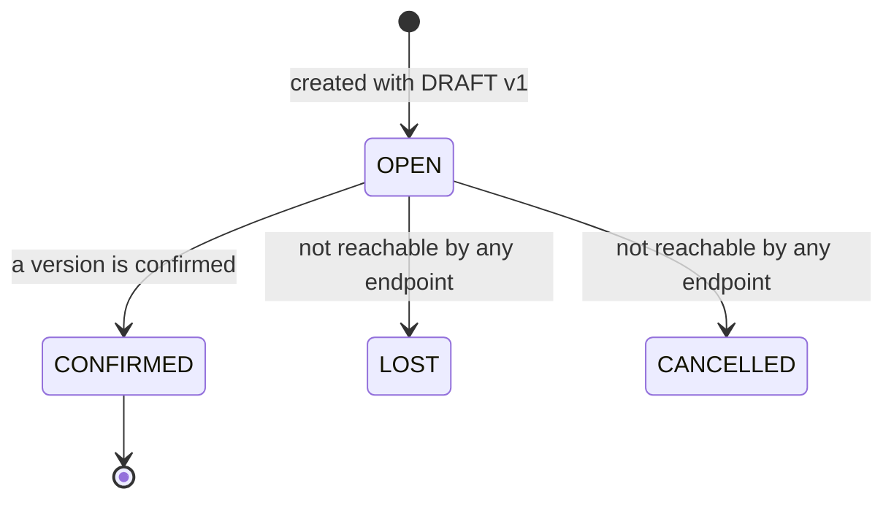

| Transition | Trigger | Notes |
|---|---|---|
| `→ OPEN` | `QuoteService.create_quote` | Default |
| `OPEN → CONFIRMED` | `OrderService.confirm_quote_version` | Set alongside the version |

**Gap.** `LOST` and `CANCELLED` exist in `QuoteStatus` but **no endpoint sets
them**. A rep cannot mark a quote lost, which means the pipeline view (PDF B2)
has no way to represent a dead deal at quote level, and `DealStage.CLOSED_LOST`
is likewise unreachable. Tracked as P1 in
[`BACKEND_GAP_ANALYSIS.md`](./BACKEND_GAP_ANALYSIS.md).

---

## 3. ApprovalRequest

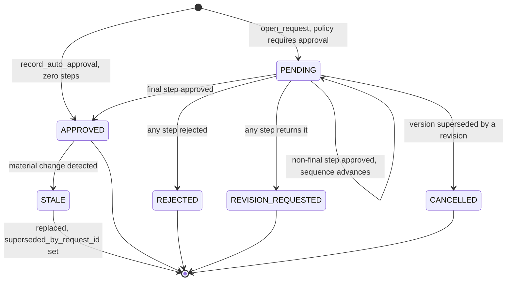

### The auto-approval row

A quote with no violations still writes an `approval_requests` row with
`status=APPROVED` and **zero steps**. Two reasons:

1. "Who approved this?" always has an answer — the policy engine did.
2. A later material change needs a concrete decision to mark `STALE`. Without
   this row, a clean quote that is later revised would have nothing to invalidate
   and the staleness guarantee would silently not apply to it.

### Who can trigger each transition

| Transition | Actor |
|---|---|
| `→ PENDING` | System, on submit or revision |
| `→ APPROVED` (auto) | System, when `requires_approval` is false |
| `PENDING → APPROVED/REJECTED/REVISION_REQUESTED` | `MANAGER` `FINANCE` `ADMIN`, matching step role, not the author |
| `PENDING → CANCELLED` | System, when the version is superseded |
| `APPROVED → STALE` | System, via `DecisionFabric` on material change |

### Invalid transitions

| Attempt | HTTP | Code |
|---|---|---|
| Decide a non-`PENDING` request | 409 | `APPROVAL_NOT_PENDING` — `details.status` |
| Decide when no step is pending at `current_step_sequence` | 409 | `NO_PENDING_STEP` — `details.already_decided[]` |
| Decide as the author or submitter | 403 | `SELF_APPROVAL_FORBIDDEN` |
| Decide a step requiring another role | 403 | `WRONG_APPROVER_ROLE` — `details.required_role`, `your_role`, `level` |
| Two approvers decide simultaneously | 409 | `NO_PENDING_STEP` for the loser |

### Critical invariant

Partial unique index `uq_approval_requests_one_pending_per_version` on
`quote_version_id WHERE status = 'PENDING'`. At most one open approval per
version, enforced by the database.

**A `STALE` request is never deleted.** It is retained with `stale_at` and
`stale_reason`, and linked forward via `superseded_by_request_id`. The audit
trail must be able to show that an approval existed, what it covered, and why it
stopped being valid.

---

## 4. ApprovalStep

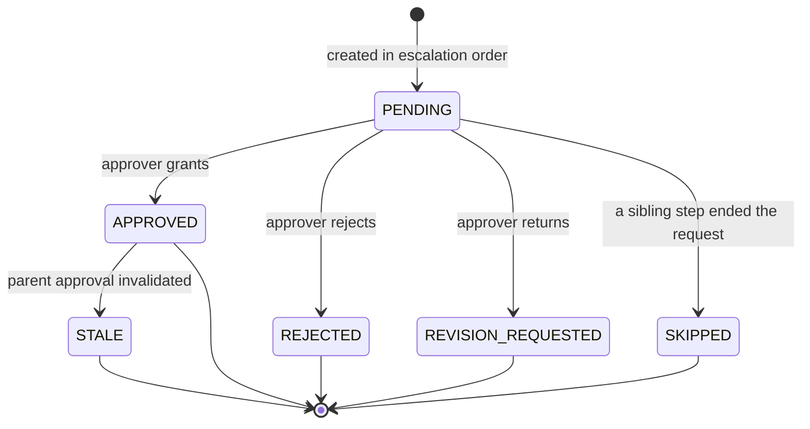

Steps are created in `APPROVAL_LEVEL_ORDER` (`SALES_MANAGER` 1 → `FINANCE` 2 →
`EXECUTIVE` 3) and satisfied by `APPROVAL_LEVEL_ROLE`
(`SALES_MANAGER`→`MANAGER`, `FINANCE`→`FINANCE`, `EXECUTIVE`→`ADMIN`).

**Ordering is enforced.** `ApprovalRequest.current_step_sequence` gates which
step is decidable. `FINANCE` attempting to approve while step 1 (`SALES_MANAGER`)
is pending receives 403 `WRONG_APPROVER_ROLE`. This is what makes PDF A3's
"Sales Manager **followed by** Finance" a sequence rather than a set.

When a step is rejected or returned, every other `PENDING` step becomes
`SKIPPED` — not `CANCELLED` — so the record shows they were never reached.

`EXECUTIVE` level exists in the enum and maps to `ADMIN`, but no seeded policy
uses it. Reachable by creating a policy with `required_action: EXECUTIVE`.

---

## 5. Deal

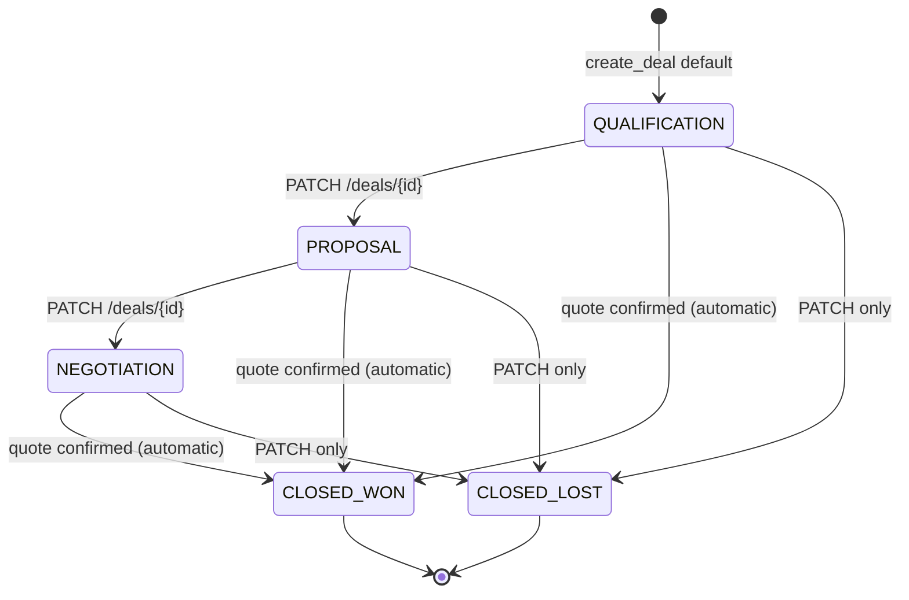

`CLOSED_WON` is the only stage set automatically — `OrderService.confirm_quote_version`
sets it. Every other transition is a manual `PATCH /deals/{deal_id}` by
`SALES`/`MANAGER`/`ADMIN`.

**No transition guard exists.** `PATCH /deals/{id}` accepts any `DealStage`
value, so a deal can move from `CLOSED_WON` back to `QUALIFICATION`. Deal health
scoring special-cases `CLOSED_WON` → 100 and `CLOSED_LOST` → 0. Tracked as a P1
validation gap.

---

## 6. NegotiationThread

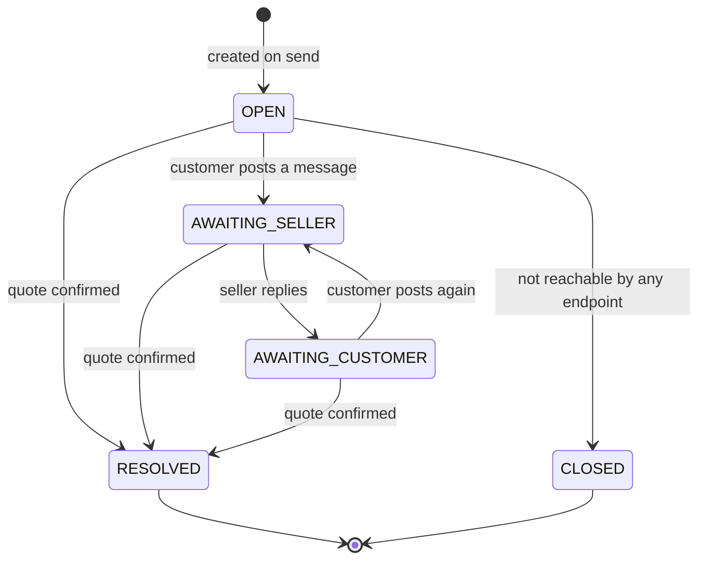

One thread per quote, enforced by `UNIQUE (quote_id)`. Created by
`QuoteService.send`; the thread survives version changes and carries the whole
conversation across revisions.

`CLOSED` is unreachable — no endpoint sets it. Low impact: `RESOLVED` covers the
real terminal case.

---

## 7. SalesOrder

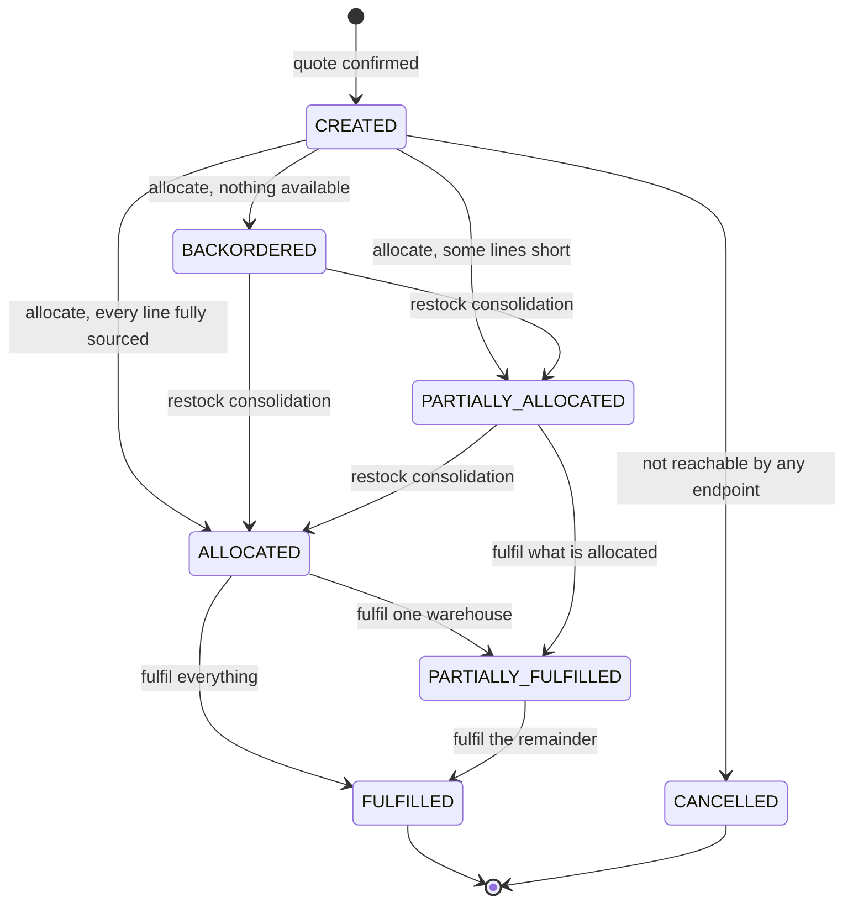

### Status derivation (not client-supplied)

`InventoryService._finalise` computes the status from the allocation outcome:

| Condition | Status |
|---|---|
| All lines fully allocated | `ALLOCATED` |
| Backorder exists and zero allocated | `BACKORDERED` |
| Some allocated, some short | `PARTIALLY_ALLOCATED` |

| Transition | Roles | Endpoint |
|---|---|---|
| `→ CREATED` | `CUSTOMER` | `POST /portal/quotes/{id}/confirm` |
| `CREATED → ALLOCATED/PARTIALLY_ALLOCATED/BACKORDERED` | `OPS` `ADMIN` `SALES` | `POST /orders/{id}/allocate` |
| `→ FULFILLED/PARTIALLY_FULFILLED` | `OPS` `ADMIN` | `POST /orders/{id}/fulfill` |
| `BACKORDERED → ALLOCATED` | `ADMIN` (indirectly) | `POST /admin/inventory/adjust` with a positive delta |

### Invalid transitions

| Attempt | HTTP | Code |
|---|---|---|
| Allocate a cancelled order | 409 | `ORDER_CANCELLED` |
| Fulfil with no allocated stock | 409 | `NOTHING_TO_FULFILL` |
| Allocate with `allow_partial=false` and a short line | 409 | `INSUFFICIENT_INVENTORY` — nothing is reserved |
| Confirm the same version twice | 409 | `ALREADY_CONFIRMED` / `DUPLICATE_OPERATION` |

**Gap.** `CANCELLED` is unreachable — no order cancellation endpoint exists, so
an order created in error cannot be voided. Tracked as P1.

---

## 8. InventoryAllocation

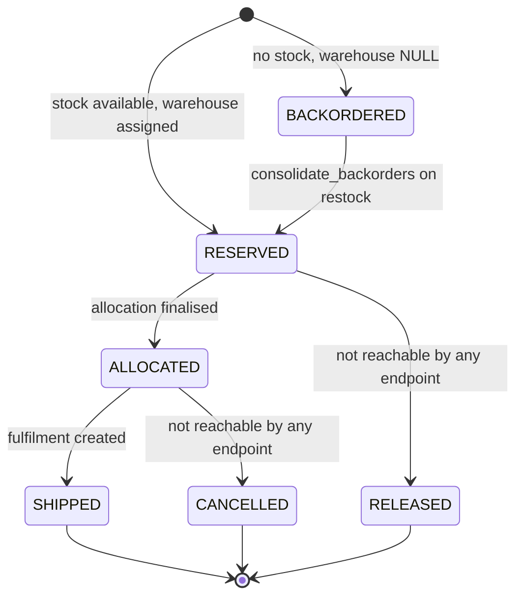

### The database-enforced invariant

```sql
CHECK ((status = 'BACKORDERED' AND warehouse_id IS NULL)
    OR (status <> 'BACKORDERED' AND warehouse_id IS NOT NULL))
```

A backorder cannot claim a warehouse, and a reservation cannot exist without
one. This is not defensive style — it is what makes "which warehouse is this
coming from?" always answerable.

`mode` records how the placement was decided: `AUTOMATIC` (the split algorithm)
or `MANUAL_OVERRIDE` (an `OPS` user placed it), satisfying PDF B6's
"Accept Suggested Split / Manual Override" audit need.

`RELEASED` and `CANCELLED` are unreachable — there is no endpoint to release a
reservation without shipping it. P1 gap: an order cancelled after allocation
would leave stock permanently reserved.

---

## 9. Fulfillment

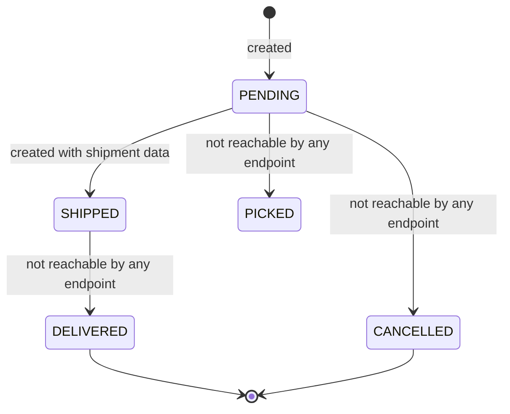

One row per warehouse, numbered by `shipment_sequence`. Shipping converts a
reservation into an outbound movement, decrementing **both**
`quantity_on_hand` and `quantity_reserved`.

**Gap.** `PICKED`, `DELIVERED` and `CANCELLED` are unreachable. `DELIVERED`
matters: PDF B9 requires "delivery promise slippage indicators", which needs
both a promised date and a delivery confirmation to compare against. Neither
exists. Tracked as P0 (part of the B9 gap).

---

## 10. BillingSchedule

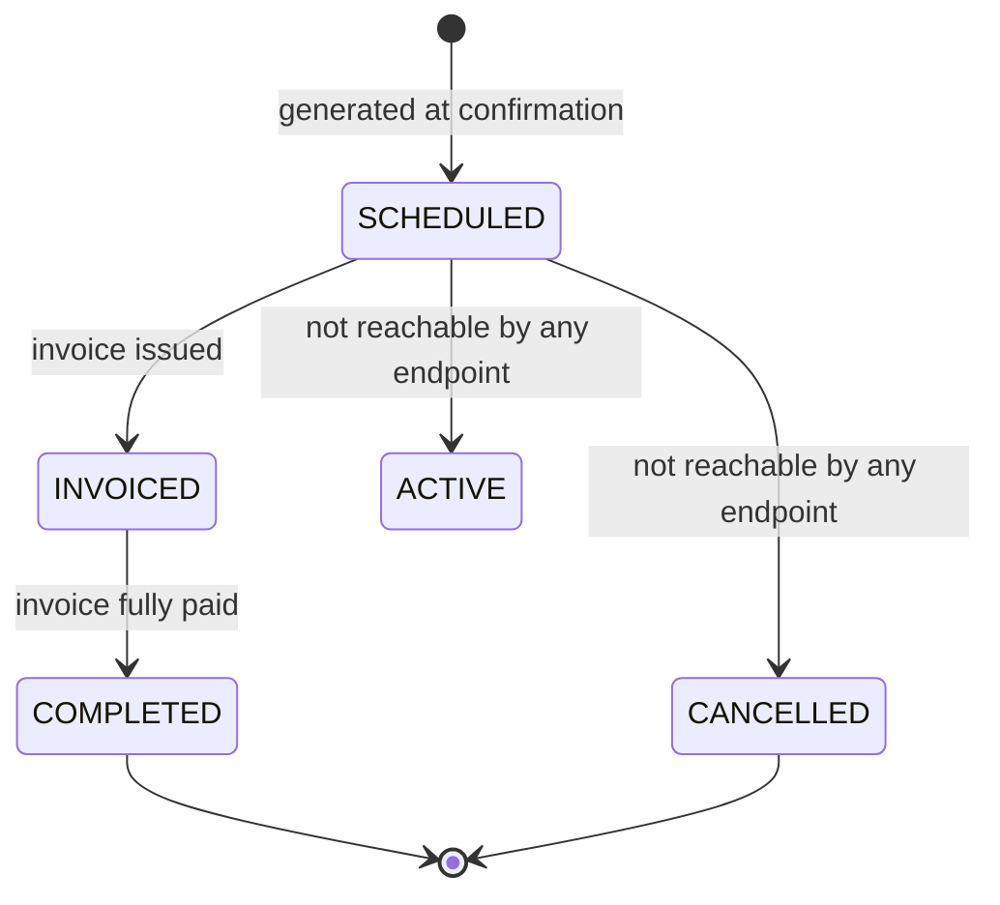

Schedules are only ever generated by `BillingService.create_schedules_for_order`
at confirmation. There is deliberately **no endpoint that creates a schedule
from nothing** — every schedule traces back to a `sales_order_lines` row.

### Exactness invariant

`SUM(schedule.amount) == line.net_amount` **exactly**, for any period count. The
final period absorbs the rounding remainder:

```
per = money(total / periods)
amounts = [per] * (periods - 1) + [money(total - per * (periods - 1))]
```

`test_split_amount_is_exact_for_any_shape` verifies awkward shapes like 0.05
over 4 periods.

| Type | Row count | Due date |
|---|---|---|
| `ONE_TIME` | One | `period_start + TERMS_DAYS[payment_terms]` |
| `RECURRING` | One **per period** | Same rule per period |

Intervals: `MONTHLY` (1 month), `QUARTERLY` (3), `YEARLY` (12). Periods are
contiguous and month-end clamped — 31 Jan + 1 month = 28 Feb, or 29 in a leap
year.

**Gap.** `ACTIVE` and `CANCELLED` are unreachable. `CANCELLED` is required by
PDF A5/B7 (subscription cancellation with partial refund or credit note). This
is the single most clearly-specified missing transition in the system. P0.

---

## 11. Invoice

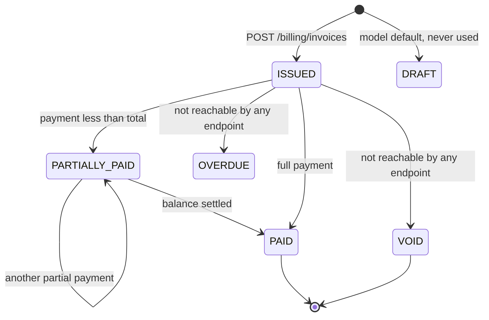

Created directly as `ISSUED` — the `DRAFT` default on the model is never used by
the endpoint. Payment recording drives the rest:

```python
invoice.amount_paid = money(invoice.amount_paid + payload.amount)
if invoice.amount_paid >= invoice.total_amount:
    invoice.status = PAID
    invoice.paid_at = now()
    if linked_schedule: schedule.status = COMPLETED
else:
    invoice.status = PARTIALLY_PAID
```

This satisfies PDF QT8: *"record a payment, and check that the invoice status
updates correctly."*

| Guard | HTTP | Code |
|---|---|---|
| Invoice a schedule already `INVOICED` | 409 | `SCHEDULE_ALREADY_INVOICED` |
| Pay a `VOID` invoice | 409 | `INVOICE_VOID` |
| Pay more than `amount_due` | 400 | `OVERPAYMENT` — `details.amount_due` |
| Non-Finance role | 403 | `FORBIDDEN` |

Database backstop: `CHECK (amount_paid >= 0 AND amount_paid <= total_amount)`.

**Gaps.** `OVERDUE` is unreachable — README §24 item 5 confirms overdue status is
computed on read rather than by a scheduler, but no read path computes it
either, so an overdue invoice looks identical to a current one. `VOID` is
unreachable, so a mis-issued invoice cannot be cancelled. Both P1.

---

## 12. Payment

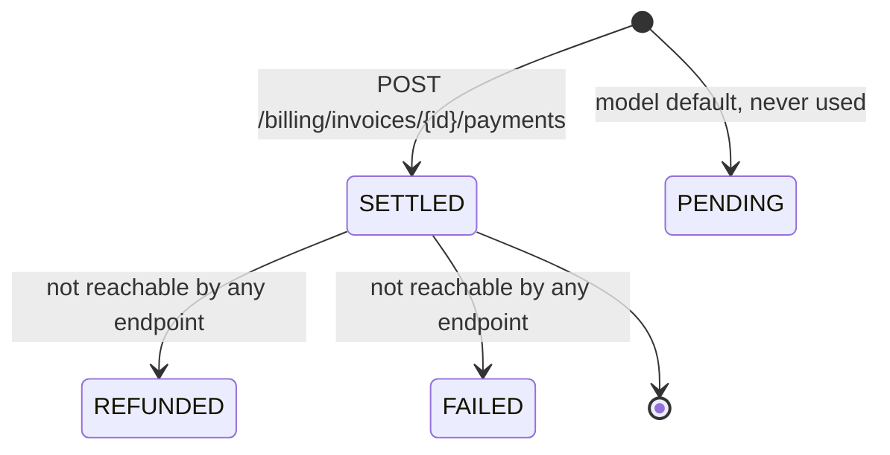

Payments are recorded as immediately `SETTLED` — this is a record-keeping
system, not a payment gateway, which is exactly what PDF QT8 asks for
("**record** a payment").

`REFUNDED` is unreachable and is required by PDF A5/B7's "partial refund"
requirement. P0, bundled with the subscription lifecycle work.

---

## 13. AttentionItem

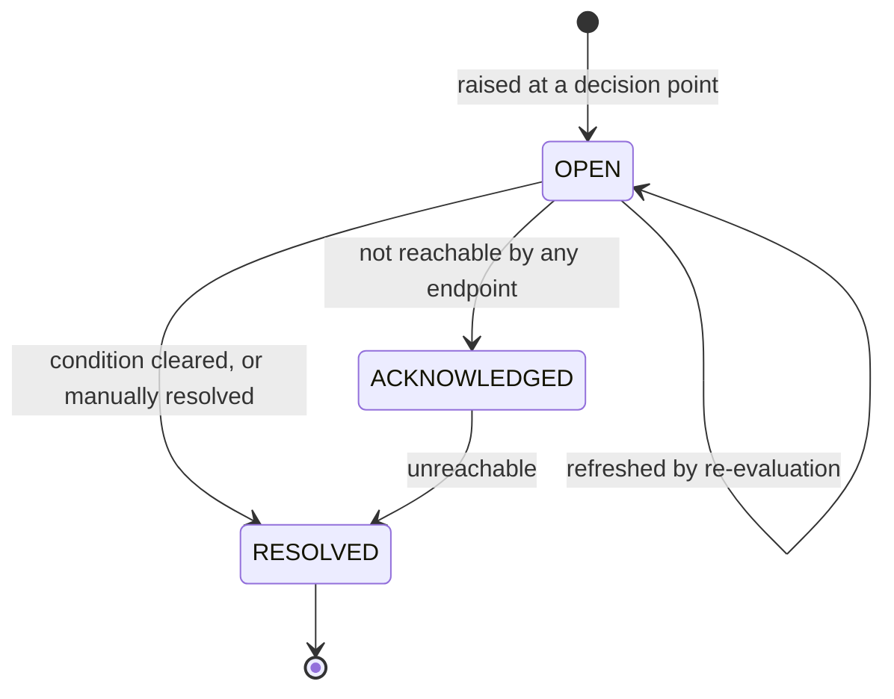

### Anti-spam invariant

```sql
UNIQUE (organization_id, source_type, source_id, type) WHERE status <> 'RESOLVED'
```

One live item per source and type, so re-evaluating a quote **refreshes** the
item rather than creating duplicates. Items are raised only at decision points
(submit, revision, counter) — never on every draft recalculation, which would
make the Control Tower unreadable within minutes.

Superseding a version retires its items: nobody can fix the margin on a version
that has been replaced.

| Type | Trigger | Owner | Severity |
|---|---|---|---|
| `STALE_APPROVAL` | Material change invalidated an approval | `FINANCE` | CRITICAL |
| `ORDER_BLOCKED` | Order blocked by a stale approval | `SALES` | CRITICAL |
| `MARGIN_VIOLATION` | Margin below the policy floor | `FINANCE` | HIGH |
| `INVENTORY_SHORTAGE` | Allocation cannot fill the order | `OPS` | HIGH |
| `PENDING_APPROVAL` | Quote awaiting a reviewer | `MANAGER`/`FINANCE` | MEDIUM |
| `CUSTOMER_RESPONSE_REQUIRED` | Customer silent or asked a question | `SALES` | MEDIUM |

**Gaps.**
1. `ACKNOWLEDGED` is unreachable. `POST .../resolve` jumps straight to
   `RESOLVED`, so there is no "I have seen this and I am on it" state — which is
   what a nudge or escalation flow needs.
2. No `DISCOUNT_ANOMALY` type exists, so PDF B9's rep-baseline alert has nowhere
   to live.
3. Only `resolve` is available; PDF B9 also requires **nudge** and **escalate**.

All P0, tracked together in [`BACKEND_GAP_ANALYSIS.md`](./BACKEND_GAP_ANALYSIS.md).

---

## 14. IdempotencyKey

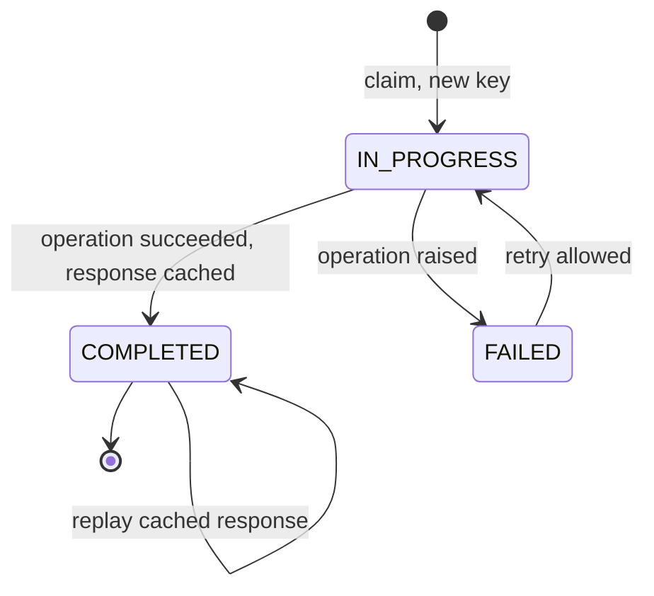

### Client-visible behaviour

| Situation | Result |
|---|---|
| No `Idempotency-Key` header | Proceed with no protection (uniqueness constraints still apply) |
| New key | Insert `IN_PROGRESS`, `expires_at = now + 7 days`, proceed |
| Same key, **same** body | Replay the stored `response_body` with `idempotent_replay: true` |
| Same key, **different** body | 409 `IDEMPOTENCY_KEY_REUSED` |
| Same key, still `IN_PROGRESS` | 409 `IDEMPOTENT_REQUEST_IN_FLIGHT` — "Retry shortly." |
| Same key, previously `FAILED` | Reset to `IN_PROGRESS` and allow the retry |

Fingerprint: `SHA-256(json.dumps(payload, sort_keys=True, separators=(",",":")))`.
Scoped by `UNIQUE (organization_id, endpoint, key)` with `SELECT FOR UPDATE` on
lookup, so two concurrent identical requests serialise rather than both
executing.

Applies to `POST /portal/quotes/{id}/confirm` and `POST /orders/{id}/allocate`.

**Gap.** `expires_at` is written but nothing prunes the table. P3.

---

## 15. Unreachable states summary

Enum values with no code path that sets them. Each is either an accepted
limitation or a tracked gap.

| Entity | Unreachable | Impact | Priority |
|---|---|---|---|
| `BillingSchedule` | `CANCELLED` | PDF A5/B7 subscription cancellation impossible | **P0** |
| `Payment` | `REFUNDED` | PDF A5/B7 partial refund impossible | **P0** |
| `Fulfillment` | `DELIVERED` | PDF B9 delivery slippage has no completion signal | **P0** |
| `AttentionItem` | `ACKNOWLEDGED` | No nudge/escalate intermediate state | **P0** |
| `Quote` | `LOST`, `CANCELLED` | Pipeline cannot show a dead quote | P1 |
| `Deal` | `CLOSED_LOST` (only via manual PATCH) | Loss is untracked automatically | P1 |
| `SalesOrder` | `CANCELLED` | An erroneous order cannot be voided | P1 |
| `InventoryAllocation` | `RELEASED`, `CANCELLED` | Cancelling after allocation would leak reserved stock | P1 |
| `Invoice` | `OVERDUE`, `VOID` | Overdue is invisible; mis-issued invoice cannot be voided | P1 |
| `Fulfillment` | `PICKED`, `CANCELLED` | No pick stage | P2 |
| `NegotiationThread` | `CLOSED` | `RESOLVED` covers the real case | P3 |
| `ApprovalLevel` | `EXECUTIVE` | Reachable by configuring a policy; no seeded policy uses it | P3 |
| `ProductCategory` | `SOFTWARE` | Valid, just unseeded | None |
| `PolicyType` | `PAYMENT_TERMS_LIMIT` | **Fully implemented** in `PolicyEngine` (evaluates `payment_terms` days against a `DAYS`-unit threshold and routes on breach) but no seeded policy uses it, so it never fires in the demo. Seeding one is a cheap credibility win | P2 |
| `OrganizationKind`, `RoleCode`, `CustomerTier`, `RiskBand`, etc. | — | All reachable | None |

---

## 16. Cross-entity transaction guarantees

These multi-entity transitions happen atomically. There is no window in which
one half is visible without the other.

| Operation | Atomic set |
|---|---|
| `create_revision` | Parent → `SUPERSEDED` · child created · lines copied with `source_line_id` · recalculated · policy re-evaluated · impacts persisted · prior approvals → `STALE` · pending requests → `CANCELLED` · new request opened · attention items raised |
| `submit` | Version status change · snapshot · policy results · approval request + steps · attention item · audit events |
| `decide` (final approve) | Step → `APPROVED` · request → `APPROVED` · version → `APPROVED` · `is_stale=false` · decision row · attention items resolved · audit events |
| `confirm` | Version → `CONFIRMED` · quote → `CONFIRMED` · deal → `CLOSED_WON` · thread → `RESOLVED` · order + lines created · billing schedules generated · idempotency record completed · audit events |
| `allocate` | Stock rows locked · reservations created · backorders created · line quantities updated · order status derived · attention items · audit events |
| `fulfill` | Fulfillment rows per warehouse · allocations → `SHIPPED` · `quantity_on_hand` and `quantity_reserved` decremented · order status · audit events |
| `record_payment` | Payment row · `invoice.amount_paid` · invoice status · linked schedule → `COMPLETED` |

Routers own the `commit()`, so each endpoint has exactly one visible transaction
boundary. Event handlers run on the caller's session, which is why an audit row
and the state change it describes cannot drift apart.
