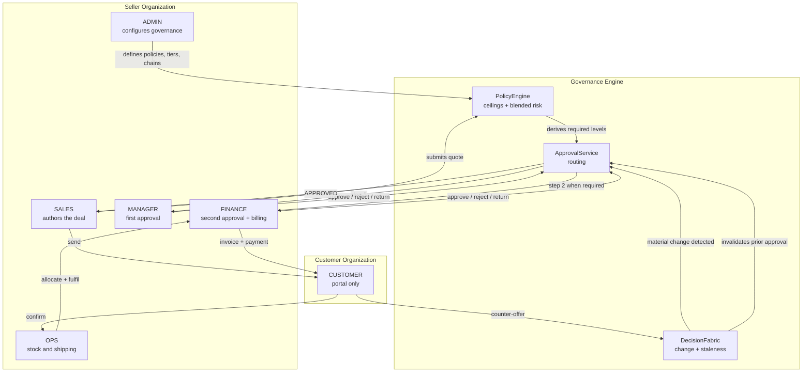

# PRODUCT USER ECOSYSTEM

Every role in this document is either named in `HackathonMatrials/DealFlow360.pdf` §3
or exists in the backend as a `RoleCode` in [`app/enums.py`](../app/enums.py).
No role is invented. Where the PDF and the backend disagree, the difference is
called out explicitly.

---

## 1. Role reconciliation: PDF versus backend

The PDF §3 names **five** roles. The backend implements **six** `RoleCode`
values. The mapping is not one-to-one and the difference is deliberate.

| PDF §3 role | Backend `RoleCode` | Relationship |
|---|---|---|
| Sales Rep | `SALES` | Exact match |
| Sales Manager / Approver | `MANAGER` | Exact match |
| Finance / Operations User | `FINANCE` **and** `OPS` | **Split into two.** The PDF bundles them; the backend separates approval authority (`FINANCE`) from physical fulfillment authority (`OPS`) |
| Customer (Portal User) | `CUSTOMER` | Exact match |
| Admin | `ADMIN` | Exact match |

### Why `FINANCE` and `OPS` are separate

The PDF describes the "Finance / Operations User" as doing three unrelated things:

> - Handles second level approvals for high risk discounts
> - Manages warehouse fulfillment splits and backorder decisions
> - Reconciles recurring billing and credit notes

Approving a discount and picking stock from a warehouse are different jobs with
different risk profiles. Collapsing them would mean anyone who can move
inventory can also sign off on margin giveaway. The backend splits them:

- `FINANCE` — second-level approval, invoices, payments, credit reconciliation
- `OPS` — allocation, override, backorder, fulfillment

This is a **superset** of the PDF requirement, not a deviation: a deployment that
wants the PDF's combined role simply grants one user both, or uses `ADMIN`.

### Two structural groupings

Defined in [`app/enums.py`](../app/enums.py):

- `INTERNAL_ROLES` = {`SALES`, `MANAGER`, `FINANCE`, `OPS`, `ADMIN`} — may use internal APIs
- `EXTERNAL_ROLES` = {`CUSTOMER`} — may use `/portal/*` only

The separation is enforced in both directions. `require_internal_user` blocks
customers from internal routes; `require_customer_user` blocks employees from
portal routes. The second direction matters more than it looks: if an employee
could call the portal endpoints, the redacted view would become an alias for the
internal one and PDF §7's "real, separate, restricted view" constraint would be
satisfied only in name.

---

## 2. Role profiles

### 2.1 `SALES` — Sales Representative

**Who they are.** The person who owns the customer relationship and builds the
quote. The PDF's primary beneficiary.

**Objective.** Get a correctly-priced, approved quote in front of the customer
and close it, without losing days to internal process.

**Pain points (PDF §1).** Manual approval requests, no visibility into stock at
quote time, negotiation trapped in email, no idea a deal has gone cold.

**Primary workflow.** Create customer profile → create deal → create quote →
add lines with discounts → watch live margin → review upsell suggestions →
submit (routing happens automatically) → send to portal → respond to negotiation
→ deal closes.

| Capability | Detail |
|---|---|
| Can see | Own organization's catalog, policies, customers, deals, quotes with full cost/margin/risk, orders, billing, audit trail, dashboards |
| Can create | Customer profiles, contacts, deals, quotes, quote lines, revisions, negotiation replies |
| Can modify | Lines on `DRAFT` versions only; deals; customer profiles |
| Can approve | **Nothing.** `SALES` receives 403 from `/approvals/inbox` and all decision endpoints |
| Must never access | Another organization's data (404); portal endpoints (403 `INTERNAL_USER_FORBIDDEN`); invoice issuance and payment recording (403) |

**Edge workflows.**
- Quote is `PENDING_APPROVAL` and needs a change → cannot edit; must create a revision (409 `IMMUTABLE_VERSION` with guidance in the message)
- Approver returns for revision → version goes back to `DRAFT` and becomes editable again
- Customer counters → a new version is created automatically; the rep did not act
- Rep tries to approve own quote → 403 before the handler runs

---

### 2.2 `MANAGER` — Sales Manager / Approver

**Who they are.** Owns a team's number and the first line of discount
governance.

**Objective.** Approve the deals that deserve it, quickly, with enough context to
defend the decision — without reviewing every quote by hand (PDF §10).

**Primary workflow.** Open approval inbox → see blended risk score and the
numbers under review → approve, reject, or return for revision with a reason →
monitor deal health dashboard.

| Capability | Detail |
|---|---|
| Can see | Everything `SALES` sees, plus the approval inbox filtered to steps awaiting **their** role |
| Can create | Everything `SALES` can create — **deliberately** (see below) |
| Can modify | Same as `SALES` |
| Can approve | `SALES_MANAGER`-level approval steps |
| Must never access | Portal endpoints; invoice/payment endpoints; `FINANCE`-level steps out of sequence (403 `WRONG_APPROVER_ROLE`); **their own authored quotes** (403 `SELF_APPROVAL_FORBIDDEN`) |

**Why `MANAGER` can author deals.** Sales managers own deals in practice, so
removing authoring rights would model the org chart badly. The safeguard is
authorship-based, not role-based: `ApprovalService.decide` refuses if the actor
is the requester, the version creator, or the quote creator. **Authorship, not
role, disqualifies an approver.** This is stricter than a role check because it
also catches an `ADMIN` trying to wave through their own work.

**Edge workflows.**
- Tries to approve a step that requires `FINANCE` → 403 with `required_role` and `your_role` in `details`
- Tries to approve a step already decided → 409 `NO_PENDING_STEP` listing what was already decided
- Approves the final step → version becomes `APPROVED`; approving a non-final step advances `current_step_sequence` and the request stays `PENDING`

---

### 2.3 `FINANCE` — Finance Approver

**Who they are.** The second-level authority on margin and signing limits.

**Objective.** Stop margin erosion and unauthorised giveaway; keep billing and
receivables correct.

**Primary workflow.** Approval inbox (only `FINANCE` steps) → review margin,
blended risk and the breached policies → decide → later, issue invoices from
billing schedules and record payments.

| Capability | Detail |
|---|---|
| Can see | All internal data including cost, margin, risk decomposition, billing schedules, invoices, payments |
| Can create | Invoices, payments. **Cannot** create deals or quotes (not in `SalesUser`) |
| Can modify | Invoice/payment state via recording actions |
| Can approve | `FINANCE`-level approval steps |
| Must never access | Portal endpoints; quote authoring endpoints (403 `FORBIDDEN` with `allowed_roles`) |

**When `FINANCE` is pulled in.** Two independent triggers:
1. A breached policy whose `required_action` is `FINANCE` (e.g. the margin floor, or the 20,000 signing-authority ceiling)
2. Blended risk score ≥ the finance escalation threshold (default 60)

**Edge workflows.**
- Tries to approve before the `MANAGER` step → 403 `WRONG_APPROVER_ROLE` (steps are ordered, not a set)
- Records a payment exceeding the balance → 400 `OVERPAYMENT` with `amount_due`
- Invoices an already-invoiced schedule → 409 `SCHEDULE_ALREADY_INVOICED`
- Payment settles the full amount → invoice `PAID`, linked schedule `COMPLETED`; partial → `PARTIALLY_PAID`

---

### 2.4 `OPS` — Operations / Fulfillment

**Who they are.** Owns physical reality: stock, splits, shipments.

**Objective.** Ship what was sold, from the cheapest viable combination of
warehouses, and be honest about what cannot ship yet.

**Primary workflow.** Open a confirmed order → review the suggested warehouse
split with shipment count and cost → accept or manually override → fulfil →
handle backorders when stock arrives.

| Capability | Detail |
|---|---|
| Can see | Warehouses, inventory (on-hand / reserved / available / inbound), orders, allocations, fulfillments, dashboards |
| Can create | Allocations, fulfillments |
| Can modify | Allocation placement via manual override |
| Can approve | **Nothing** |
| Must never access | Portal endpoints; approval endpoints (403); quote authoring (403); invoice issuance (403) |

**Edge workflows.**
- Order cannot be fully sourced → remainder becomes a `BACKORDERED` allocation with no warehouse and the earliest expected restock date; order becomes `PARTIALLY_ALLOCATED` or `BACKORDERED`
- `allow_partial=false` and any line is short → 409 `INSUFFICIENT_INVENTORY`, nothing is reserved
- Manual override exceeds real availability → 409 `INSUFFICIENT_INVENTORY` naming the warehouse and the numbers
- Manual override exceeds the line's outstanding quantity → 400 `OVERRIDE_EXCEEDS_LINE`
- Two allocations race for the last unit → serialised by `SELECT ... FOR UPDATE`; a `CHECK` constraint is the backstop
- Fulfil with nothing allocated → 409 `NOTHING_TO_FULFILL`

---

### 2.5 `ADMIN` — Administrator

**Who they are.** Configures the system and holds break-glass authority.

**Objective.** Make the governance rules match company policy, and keep the
platform's reference data correct.

**Primary workflow.** Configure catalog (products, variants, price lists) →
configure discount tiers and approval chains (policies) → configure warehouses
and stock → configure subscription plans → manage users → view platform-wide
analytics.

| Capability | Detail |
|---|---|
| Can see | Everything internal, plus the user list for their organization |
| Can create | Products, variants, price lists, warehouses, inventory, policies, users; and everything `SALES` can create |
| Can modify | Products, policies, inventory adjustments, customers, deals, users |
| Can approve | **Any** approval step, at any level |
| Must never access | Portal endpoints; **their own authored quotes** for approval (403 `SELF_APPROVAL_FORBIDDEN`) |

**Break-glass caveat.** `ADMIN` bypasses the per-step role check in
`ApprovalService.decide`. This is convenient for a demo and every action is
audited, but a production deployment should split configuration authority from a
narrowly-scoped emergency-approval role. Documented as a known limitation in
[`SECURITY_AUDIT.md`](./SECURITY_AUDIT.md).

---

### 2.6 `CUSTOMER` — Portal User (external)

**Who they are.** The buyer. Belongs to an organization of kind `CUSTOMER`, not
to the seller organization.

**Objective.** Understand the offer, push back on specific lines, and accept
without an email thread.

**Pain points (PDF §1).** A static PDF, email ping-pong, no line-level way to say
"this one item is too expensive."

**Primary workflow.** Log in → list quotes issued to their organization → open a
quote (totals, discounts, line prices — **no cost, margin, or risk**) → comment
on a line, ask a question, or submit a counter-offer → wait for review → confirm.

| Capability | Detail |
|---|---|
| Can see | Only quotes issued to **their own** customer organization, and only non-`DRAFT` versions. Seller name, line descriptions, quantities, list price, net price, discount, tax, totals, validity, negotiation thread |
| Can create | Negotiation messages: `COMMENT`, `QUESTION`, `CHANGE_REQUEST`, `COUNTER_OFFER`. Order confirmation |
| Can modify | Nothing directly. A `COUNTER_OFFER` causes the **backend** to create a new version |
| Can approve | Nothing internally. Can **confirm** the quote, which is a commercial acceptance, not an approval |
| **Must never access** | `unit_cost`, `line_cost`, `line_margin`, `line_margin_pct`, `internal_cost`, `total_cost`, `margin`, `margin_pct`, `blended_risk_score`, `risk_band`, policy results, approval records, internal reasoning, `DRAFT` versions, any other customer's data, every internal endpoint |

**How redaction is guaranteed.** Not by filtering at call sites. The portal
response models (`QuotePublicRead`, `QuoteVersionPublicRead`,
`QuoteLinePublicRead`, `OrderPublicRead` in [`app/schemas/quote.py`](../app/schemas/quote.py)
and [`app/schemas/order.py`](../app/schemas/order.py)) **do not declare** cost,
margin or risk fields at all. A developer cannot forget to redact a field that
does not exist in the schema. The end-to-end test asserts the serialised portal
payload contains none of the forbidden substrings or internal values.

**Edge workflows.**
- Requests another organization's quote → 404 (not 403) so ids cannot be enumerated
- Opens a quote whose only version is `DRAFT` → 404 "This quote has no issued version yet"
- Counters a quote that is already confirmed → 409 `ALREADY_CONFIRMED`
- Submits an empty counter-offer → 400 `EMPTY_COUNTER_OFFER`
- Counters a line not on the current version → 404
- Tries to post `SELLER_REPLY` or `SYSTEM` message types → 422 at schema validation
- Confirms while an approval is stale → 409 `STALE_APPROVAL`, and the portal shows only *"Your requested changes are being reviewed by our team"* with no margin or policy detail
- Double-clicks Confirm with an `Idempotency-Key` → same order replayed, `idempotent_replay: true`
- Double-clicks without a key → the `UNIQUE` constraint on `sales_orders.quote_version_id` still guarantees one order

---

## 3. Cross-role interaction map



**The loop that matters.** `CUSTOMER` counter-offer → `DecisionFabric` →
invalidated approval → back to `MANAGER`/`FINANCE`. The customer, who has the
least authority in the system, can force the most senior approver to re-decide.
That is the self-governing property PDF §1 asks for, and no role had to remember
to trigger it.

---

## 4. Accountability chain

For any order, the following questions have a single, queryable answer:

| Question | Source |
|---|---|
| Who authored the quote? | `quotes.created_by_user_id`, `quote_versions.created_by_user_id` |
| Who submitted it for approval? | `approval_requests.requested_by_user_id` |
| Who approved it, at which level, and why? | `approval_decisions` — actor id, role, email, reason, timestamp |
| What numbers were they looking at? | `approval_decisions.decision_snapshot` + `commercial_snapshots` |
| Was that approval still valid at conversion? | `approval_requests.status`, `stale_at`, `stale_reason` |
| Who confirmed the order? | `sales_orders.confirmed_by_user_id` |
| Who allocated the stock, and manually or automatically? | `inventory_allocations.allocated_by_user_id`, `.mode` |
| Who invoiced and who recorded payment? | `invoices`, `payments.recorded_by_user_id` |
| Everything, in order? | `audit_events` ordered by `sequence` |

`audit_events` has no `updated_at` column, so there is nothing to rewrite
history with.

---

## 5. Known role-layer inconsistency

[`app/dependencies.py`](../app/dependencies.py) defines `OpsUser` as a reusable
dependency:

```python
OpsUser = Annotated[User, Depends(require_role(RoleCode.OPS, RoleCode.ADMIN))]
```

It is **never used**. [`app/routers/orders.py`](../app/routers/orders.py)
instead performs inline checks inside the handler bodies:

```python
if user.role_code not in (RoleCode.OPS, RoleCode.ADMIN, RoleCode.SALES):
    raise AuthorizationError("Only OPS, SALES or ADMIN may allocate inventory.", ...)
```

The same pattern appears in [`app/routers/billing.py`](../app/routers/billing.py)
for the `FINANCE`/`ADMIN` invoice and payment restrictions.

**Consequences.** The authorization is correct and enforced, but:
1. It is invisible to the OpenAPI schema, so generated clients and the docs page
   do not show which roles may call these routes.
2. It runs after the handler starts rather than as a declared dependency, which
   is inconsistent with the rest of the codebase.
3. `allocate` permits `SALES` in addition to `OPS`/`ADMIN`, which is broader than
   `OpsUser` would allow — a real decision, but an undocumented one.

Tracked as a P1 consistency item in [`BACKEND_GAP_ANALYSIS.md`](./BACKEND_GAP_ANALYSIS.md).
