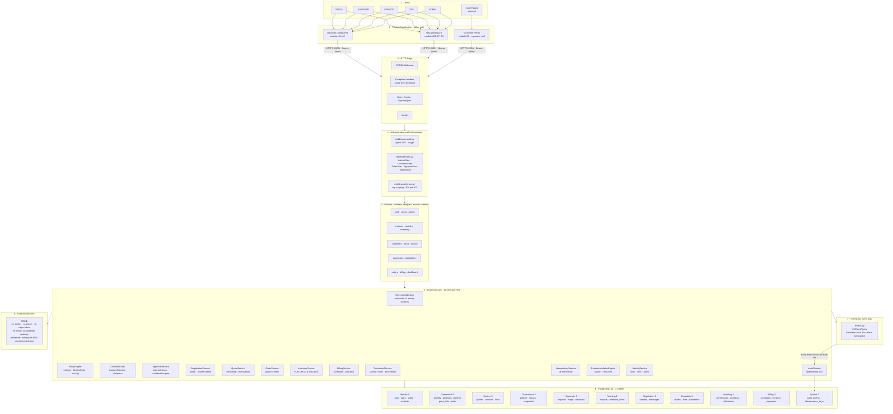
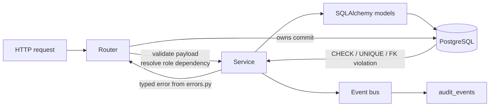
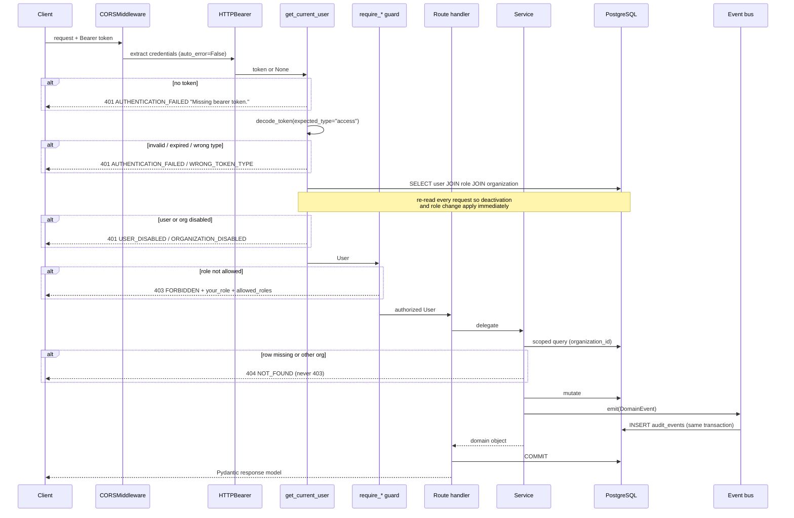
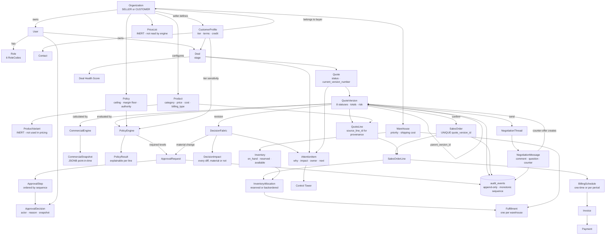
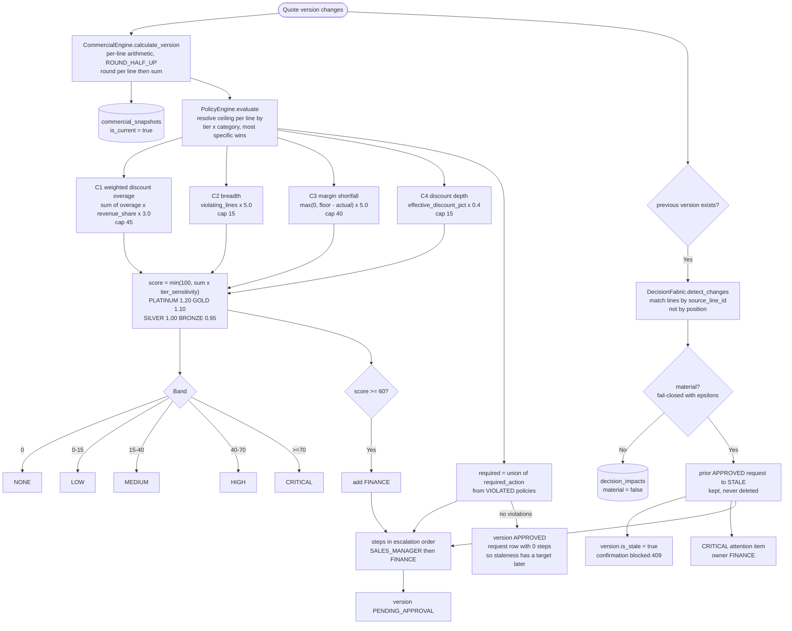
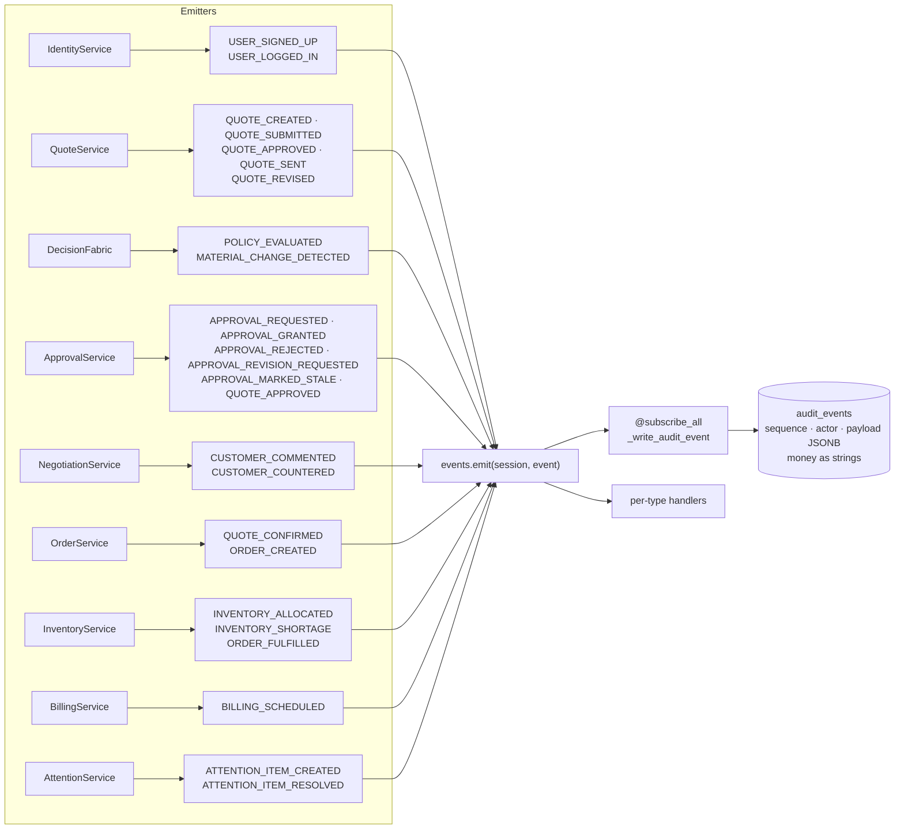
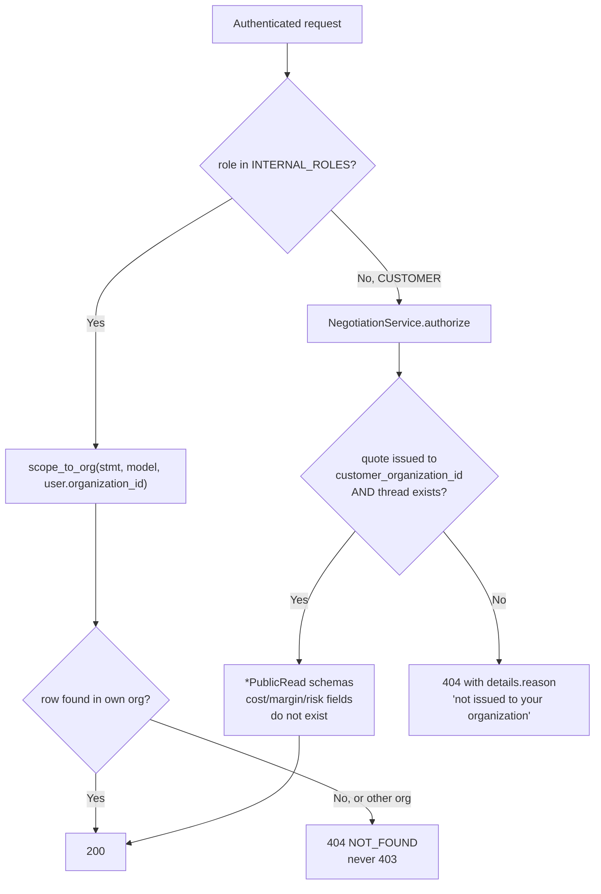
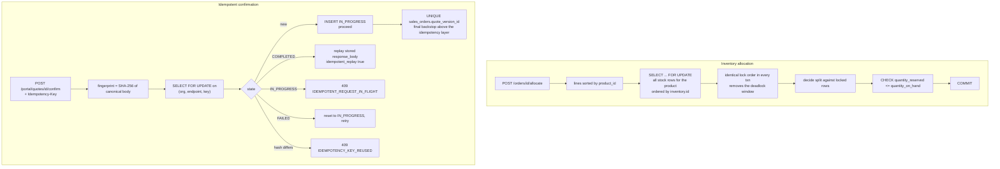
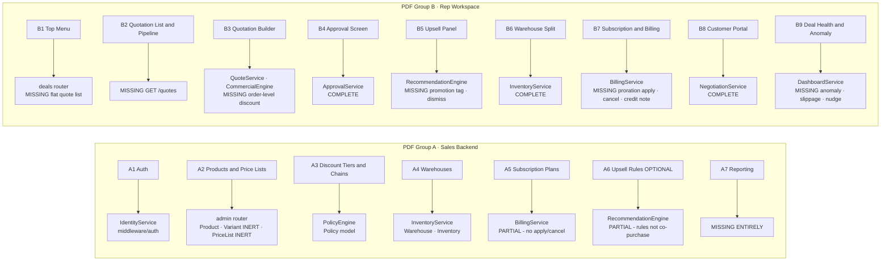
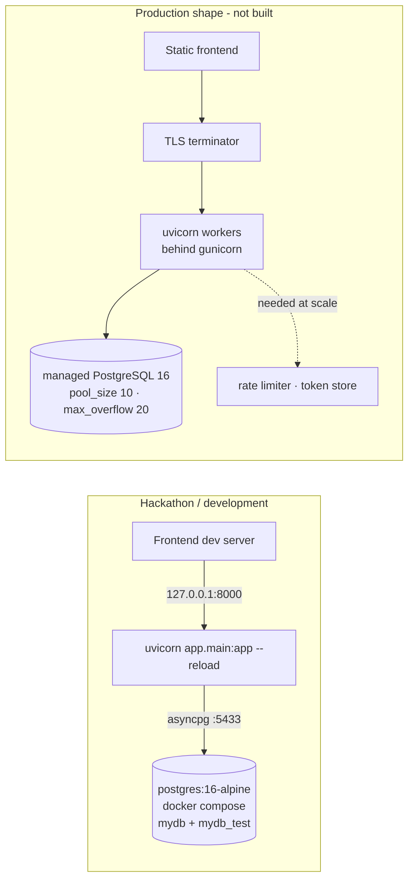

# SYSTEM ARCHITECTURE

Satisfies PDF §8 deliverable D3: *"A one-page architecture diagram showing the
data model and how the major modules connect."*

Stack: Python 3.13 · FastAPI 0.115 · SQLAlchemy 2.0 async (asyncpg) ·
Pydantic v2 · Alembic 1.14 · PostgreSQL 16 · JWT (python-jose) · bcrypt (passlib).

---

## 1. The one-page diagram

**Why layer 9 is empty.** Every requirement in the PDF is satisfiable in-process.
An event broker, cache, or object store would add operational surface without
serving a stated requirement — see [`PROBLEM_ANALYSIS.md`](./PROBLEM_ANALYSIS.md)
§F "UNNECESSARY". The event bus runs handlers on the caller's session so an
audit record and the state change it describes commit or roll back together;
a broker would break exactly that guarantee.

---

## 2. Layering rules

| Rule | Rationale |
|---|---|
| Routers never contain business rules | They validate input, call one service, and own `commit()`. The transaction boundary is visible in one place per endpoint. |
| Services never return HTTP concerns | They raise typed errors from [`app/errors.py`](../app/errors.py) which map to one JSON envelope via three exception handlers in [`app/main.py`](../app/main.py). |
| The database is the last line of defence | Where an invariant can be a constraint, it is — so an application bug produces a failed transaction rather than corrupt commercial data. |
| `CommercialEngine` is the only writer of financial columns | One place to audit money arithmetic. |
| Event handlers run inline on the caller's session | Audit and business state cannot drift. Handler failure fails the operation on purpose. |

---

## 3. Request lifecycle

---

## 4. Feature relationship diagram

---

## 5. The governance core

This is the part that answers PDF §1's "self governing deal engine" claim.

**Amount-unit policies contribute 0 to the score.** Signing authority is a
question of *who* must approve, not *how risky* the deal is; mixing currency into
a percentage-point score would make the number meaningless. They still route
approvals — which is how the canonical demo pulls in Finance on a quote whose
margin is perfectly healthy.

---

## 6. Event flow

25 `EventType` values, one global subscriber that writes an `audit_events` row.

`sequence` is a monotonic `BIGINT IDENTITY` because a single transaction emits
half a dozen events sharing the same microsecond; it gives a stable total
ordering for the timeline endpoint.

Money in payloads is stored as **strings**. A float round-trip through JSONB
would corrupt the record of a decision.

---

## 7. Tenant isolation

**Why 404 and not 403.** A 403 confirms the id exists, enabling enumeration. All
cross-tenant access returns 404. `TenantIsolationError` exists in
[`app/errors.py`](../app/errors.py) but is deliberately never raised.

**Two different isolation mechanisms.** Internal users match on
`organization_id`. Customer portal users never match on `organization_id` at all
— their access comes through `customer_profiles.customer_organization_id`,
checked explicitly by `NegotiationService.authorize`.

---

## 8. Concurrency and idempotency

Two independent layers protect confirmation. Even with no `Idempotency-Key`, the
`UNIQUE` constraint on `sales_orders.quote_version_id` makes a duplicate order
impossible; the loser of the race returns the existing order rather than an error.

---

## 9. Module boundaries mapped to PDF modules

Full traceability in [`REQUIREMENT_TRACEABILITY_MATRIX.md`](./REQUIREMENT_TRACEABILITY_MATRIX.md).

---

## 10. Deployment topology

`docker-compose.yml` publishes PostgreSQL on **5433** to avoid clashing with a
local install and creates `mydb_test` on first boot via
`scripts/init_test_db.sql`. `app/config.py` rejects any `DATABASE_URL` that is
not `postgresql+asyncpg://`, so the app cannot be started against SQLite by
accident.

---

## 11. Configuration surface

All settings are environment-driven via `pydantic-settings`; no credential or
tunable is hardcoded in business code.

| Group | Variables |
|---|---|
| App | `APP_NAME` `APP_VERSION` `ENVIRONMENT` `DEBUG` `API_PREFIX` |
| Database | `DATABASE_URL` `TEST_DATABASE_URL` `DB_POOL_SIZE` `DB_MAX_OVERFLOW` `DB_ECHO` |
| JWT | `JWT_SECRET_KEY` `JWT_ALGORITHM` `ACCESS_TOKEN_EXPIRE_MINUTES` `REFRESH_TOKEN_EXPIRE_DAYS` `BCRYPT_ROUNDS` |
| CORS | `CORS_ORIGINS` |
| Commercial | `DEFAULT_TAX_RATE_PCT` `MONEY_DECIMAL_PLACES` |
| Risk weights | `RISK_DISCOUNT_OVERAGE_WEIGHT` `RISK_BREADTH_WEIGHT` `RISK_MARGIN_WEIGHT` `RISK_DEPTH_WEIGHT` `RISK_FINANCE_ESCALATION_THRESHOLD` |
| Seed | `SEED_DEFAULT_PASSWORD` |

**Architectural gap.** The risk weights and the finance escalation threshold are
process-global environment variables. PDF A3 requires the approval chain to be
**configurable per organization**, and B9 requires a **configured** stalled-deal
window (currently the module constant `NO_RESPONSE_DAYS = 14`). These belong in a
per-tenant settings table. Tracked as P0 in
[`BACKEND_GAP_ANALYSIS.md`](./BACKEND_GAP_ANALYSIS.md).

---

## 12. What the architecture deliberately does not have

| Absent | Reason |
|---|---|
| Message broker | In-process events keep audit and state in one transaction. A broker would break that guarantee to solve a problem this system does not have. |
| Redis / cache layer | No read path is hot enough to justify cache-invalidation complexity on governed financial data. |
| Object storage / file upload | No PDF requirement involves file upload. Verified: zero `UploadFile`, `FileResponse` or `StreamingResponse` in the codebase. |
| WebSocket / SSE | Verified absent. "Real time" in the PDF means recomputed-on-read, which the request/response cycle satisfies. Frontend uses refetch-on-action plus optional polling. |
| Background scheduler | Stalled-deal and overdue-invoice states are computed on read. Honest limitation; a cron would be needed for outbound nudges. |
| Email / SMS delivery | The portal is the PDF's explicit replacement for email. |
| Payment gateway | PDF QT8 requires *recording* a payment and updating invoice status, not processing one. |
| Multi-currency FX | PDF §7 calls it a bonus. Currency is stored per quote and order; no conversion. |
