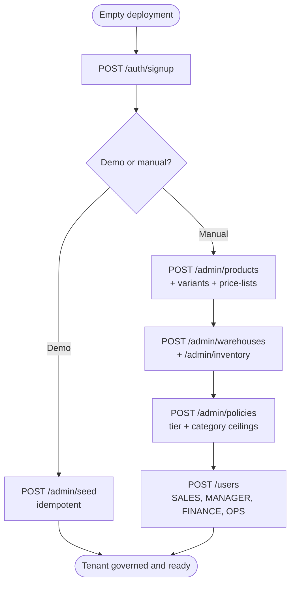
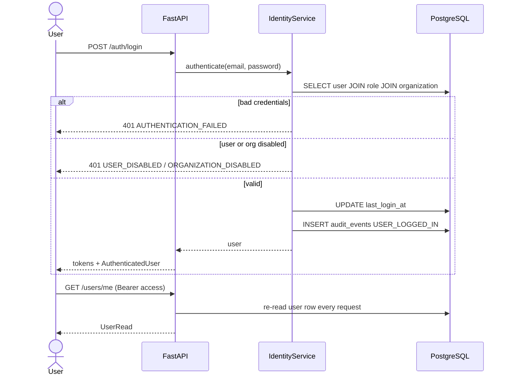
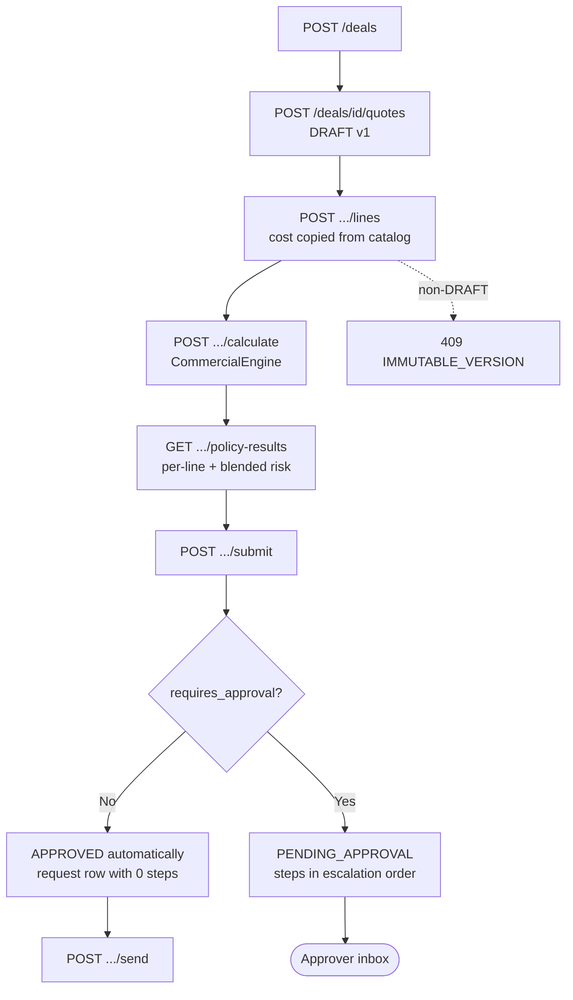
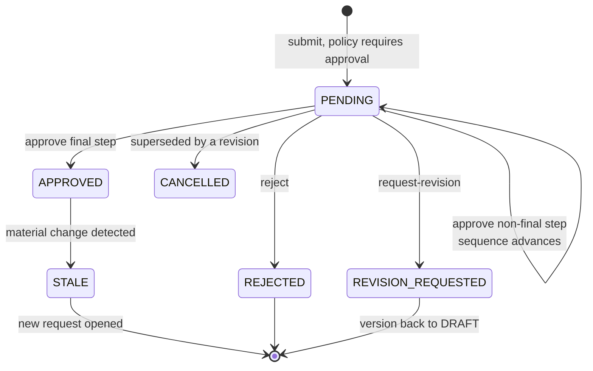
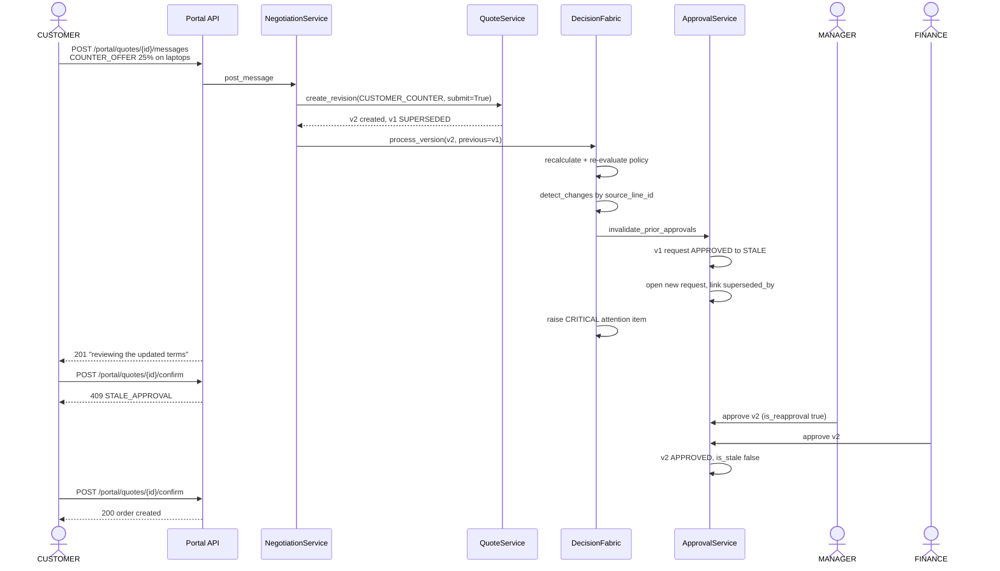

# USER JOURNEYS

Every journey below is traced to an actual endpoint sequence and the actual
service behaviour in [`app/services/`](../app/services/). Numbers in the worked
examples come from the deterministic seed dataset and are asserted by
[`tests/test_end_to_end.py`](../tests/test_end_to_end.py).

Journeys marked **GAP** depend on functionality that does not yet exist; they are
listed so the frontend plan does not assume support that is absent. See
[`BACKEND_GAP_ANALYSIS.md`](./BACKEND_GAP_ANALYSIS.md).

---

## Journey index

| # | Journey | Role | Status |
|---|---|---|---|
| J1 | First-time tenant setup | `ADMIN` | Supported |
| J2 | Returning user login | any | Supported |
| J3 | Build and submit a quote | `SALES` | Supported |
| J4 | Auto-approval of a clean quote | `SALES` | Supported |
| J5 | Multi-step approval chain | `MANAGER` → `FINANCE` | Supported |
| J6 | Return for revision | `MANAGER`/`FINANCE` | Supported |
| J7 | Send to customer and negotiate | `SALES` ↔ `CUSTOMER` | Supported |
| J8 | Counter-offer → staleness → blocked confirmation → recovery | `CUSTOMER` + approvers | Supported |
| J9 | Confirm and convert to order | `CUSTOMER` | Supported |
| J10 | Allocate across warehouses | `OPS` | Supported |
| J11 | Backorder and consolidation on restock | `OPS`/`ADMIN` | Supported |
| J12 | Fulfil in multiple shipments | `OPS` | Supported |
| J13 | Billing schedules, invoice, payment | `FINANCE` | Supported |
| J14 | Control Tower triage | `MANAGER` | Supported |
| J15 | Audit investigation | any internal | Supported |
| J16 | Upsell suggestion accepted mid-build | `SALES` | Partial |
| J17 | Mid-cycle subscription change | `FINANCE` | **GAP** |
| J18 | Subscription cancellation with credit note | `FINANCE` | **GAP** |
| J19 | Sales performance reporting with filters | `MANAGER`/`ADMIN` | **GAP** |
| J20 | Discount anomaly investigation | `MANAGER` | **GAP** |
| J21 | Nudge or escalate from an alert | `MANAGER` | **GAP** |

---

## J1 — First-time tenant setup (`ADMIN`)

**Trigger.** A fresh deployment with an empty database.
**Intent.** Make the governance rules match company policy before any rep quotes.
**Entry point.** `POST /auth/signup` then `/admin/*`.

| Step | Call | Backend operation | Data created |
|---|---|---|---|
| 1 | `POST /auth/signup` | `IdentityService.signup` — creates org + role rows if absent, hashes password (bcrypt 12) | `organizations`, `roles`, `users` |
| 2 | `POST /admin/seed` *(demo shortcut)* | `seed_canonical_data` — idempotent natural-key lookups | 2 orgs, 6 users, 1 profile, 1 contact, 4 products, 2 warehouses, 4 stock rows, 6 policies |
| 3 | `POST /admin/products` | SKU uniqueness pre-check | `products` |
| 4 | `POST /admin/product-variants` | Parent product ownership check | `product_variants` |
| 5 | `POST /admin/price-lists` | — | `price_lists` |
| 6 | `POST /admin/warehouses` | Code uniqueness pre-check | `warehouses` |
| 7 | `POST /admin/inventory` | `InventoryService.upsert_stock` | `inventory` |
| 8 | `POST /admin/policies` | Code uniqueness pre-check | `policies` |
| 9 | `POST /users` | Role/org-kind compatibility check | `users` |

**Permission checks.** Every `/admin/*` route is `AdminUser`. A `CUSTOMER` role in a
`SELLER` org (or vice versa) is rejected with 400 `ROLE_ORG_MISMATCH`.

**Success.** `POST /admin/seed` returns `{"status":"ok","idempotent":true|false,"created":{...}}`.
**Failure.** 409 `SKU_EXISTS` / `WAREHOUSE_CODE_EXISTS` / `POLICY_CODE_EXISTS` / `EMAIL_ALREADY_REGISTERED`.
**Recovery.** Re-running the seed is safe; it creates nothing and never disturbs live inventory reservations.



---

## J2 — Returning user login (any role)

**Trigger.** User opens the app.
**Entry point.** `POST /auth/login`.

| Step | Call | Notes |
|---|---|---|
| 1 | `POST /auth/login` | `IdentityService.authenticate`; emits `USER_LOGGED_IN` audit event with IP; updates `last_login_at` |
| 2 | store `tokens.access_token` (3600s) and `tokens.refresh_token` (7 days) | |
| 3 | `GET /users/me` | Re-reads the user row, so deactivation applies immediately |
| 4 | route by `user.role` and `user.is_internal` | `CUSTOMER` → portal shell; internal → workspace shell |

**Failure paths.**

| Condition | Response |
|---|---|
| Wrong credentials | 401 `AUTHENTICATION_FAILED` — *"Invalid email or password."* |
| Deactivated user | 401 `USER_DISABLED` |
| Deactivated organization | 401 `ORGANIZATION_DISABLED` |
| Expired access token | 401 `AUTHENTICATION_FAILED` — *"Token is invalid or expired."* |
| Refresh token used as bearer | 401 `WRONG_TOKEN_TYPE` |

**Recovery.** `POST /auth/refresh` with the refresh token returns a fresh pair.
On 401 from refresh, clear state and return to login.



---

## J3 — Build and submit a quote (`SALES`)

**Trigger.** A qualified opportunity.
**Intent.** Price the deal correctly and get it moving without asking anyone for approval manually.

| Step | Call | Backend operation |
|---|---|---|
| 1 | `POST /customers` | Creates buyer org on the fly if only a name is supplied |
| 2 | `POST /deals` | Auto-generates `reference` as `D-00001` if omitted; inherits currency from the profile |
| 3 | `POST /deals/{id}/quotes` | `QuoteService.create_quote` — creates quote + `DRAFT` v1, optionally with lines in one call; emits `QUOTE_CREATED` |
| 4 | `POST /quote-versions/{v}/lines` | Copies `unit_cost` **from the catalog** — a client cannot supply cost (`extra="forbid"`) |
| 5 | `PATCH .../lines/{id}` | `DRAFT` only |
| 6 | `POST /quote-versions/{v}/calculate` | `CommercialEngine.calculate_version` → totals + snapshot; `PolicyEngine` → risk |
| 7 | `GET /quote-versions/{v}/policy-results` | Per-line evaluation, blended risk with component arithmetic, required approvals |
| 8 | `POST /quote-versions/{v}/submit` | `DecisionFabric.process_version` → routing derived from breached policies |

**Worked example (seed data, GOLD tier).** 100 laptops @18%, 100 monitors @16%,
1 installation @18%, 1 annual support @0%:

- gross 160,800.00 · discount 28,090.00 · net **132,710.00**
- cost 100,200.00 · margin **32,510.00** (**24.4970%**)
- one-time 132,410.00 · recurring 300.00
- three ceiling breaches + the 20,000 signing-authority limit
- blended risk **32.4443** → **MEDIUM**
- routing: **SALES_MANAGER → FINANCE**

**Data created.** `quotes`, `quote_versions`, `quote_lines`,
`commercial_snapshots`, `policy_results`, `approval_requests`, `approval_steps`,
`attention_items` (PENDING_APPROVAL), `audit_events`.

**Failure paths.**

| Condition | Response |
|---|---|
| Product not in catalog / inactive / other org | 404 `NOT_FOUND` |
| `recurring_periods` on a one-time product | 400 `BUSINESS_RULE_VIOLATION` |
| Submit with no lines | 400 `EMPTY_QUOTE` |
| Submit a non-`DRAFT` version | 409 `VERSION_NOT_DRAFT` |
| Edit a line after submit | 409 `IMMUTABLE_VERSION` with `editable_statuses: ["DRAFT"]` |
| `quantity <= 0` or `discount_pct` outside 0–100 | 422 `VALIDATION_ERROR` |

**Recovery.** After submit, the version is immutable — the rep creates a revision
(`POST /quote-versions/{v}/revisions`), which supersedes the parent and re-runs governance.



---

## J4 — Auto-approval of a clean quote (`SALES`)

**Trigger.** A quote that breaches no policy (e.g. 5 laptops @10%, seeded ceiling 15%).

`POST /quote-versions/{v}/submit` → `requires_approval: false` → status jumps
straight from `DRAFT` to **`APPROVED`**.

Critically, an `approval_requests` row with `status=APPROVED` and **zero steps**
is still written. Approval by the policy engine is still a decision: *"who
approved this?"* always has an answer, and a later material change has a
concrete record to mark `STALE`. Without this, a clean quote that is later
revised would have nothing to invalidate.

This directly satisfies PDF B3: *"Confirm and move to approval, or straight to
fulfillment if no approval is required."*

---

## J5 — Multi-step approval chain (`MANAGER` → `FINANCE`)

**Trigger.** `APPROVAL_REQUESTED` event; an item appears in the approver's inbox.

| Step | Call | Backend operation |
|---|---|---|
| 1 | `GET /approvals/inbox` | Returns only steps whose `required_role` matches the caller **and** are the current pending sequence |
| 2 | `GET /approvals/{id}` | Full detail incl. `financials` — the exact numbers under review |
| 3 | `POST /approvals/{id}/approve` | `ApprovalService.decide` |

**Inbox item fields.** `quote_number`, `version_number`, `title`,
`customer_name`, `level`, `sequence`, `reason`, `blended_risk_score`,
`total_revenue`, `margin_pct`, `requested_by_email`, `is_reapproval`,
`waiting_since`.

`is_reapproval` is the flag that lets the UI say *"this was approved before and
the terms changed"* — the single most demo-relevant field in the payload.

**Decision effects.**

| Decision | Step | Request | Version |
|---|---|---|---|
| `APPROVE` (non-final) | `APPROVED` | stays `PENDING`, `current_step_sequence` advances | stays `PENDING_APPROVAL` |
| `APPROVE` (final) | `APPROVED` | `APPROVED` | **`APPROVED`**, `is_stale=false`, `approved_at` set |
| `REJECT` | `REJECTED`, others `SKIPPED` | `REJECTED` | **`REJECTED`** (immutable forever) |
| `REQUEST_REVISION` | `REVISION_REQUESTED`, others `SKIPPED` | `REVISION_REQUESTED` | **`DRAFT`**, `submitted_at` cleared |

**Failure paths.**

| Condition | Response |
|---|---|
| `SALES` calls the inbox | 403 `FORBIDDEN` with `allowed_roles` |
| `FINANCE` jumps ahead of the `MANAGER` step | 403 `WRONG_APPROVER_ROLE` with `required_role`, `your_role`, `level` |
| Actor authored or submitted the quote | 403 `SELF_APPROVAL_FORBIDDEN` with all three user ids |
| Step already decided | 409 `NO_PENDING_STEP` with `already_decided[]` |
| Request no longer pending | 409 `APPROVAL_NOT_PENDING` with `status` |
| Two approvers act simultaneously | First commits; second gets 409 `NO_PENDING_STEP` |

**Audit.** Each decision writes an `approval_decisions` row with actor id, role,
email, reason, timestamp and a `decision_snapshot` of the financials — satisfying
PDF A3's *"logged with user, timestamp, and reason"* and B4's *"full audit trail entry."*



---

## J6 — Return for revision

`POST /approvals/{id}/request-revision` with a reason. The version returns to
`DRAFT` and becomes editable again. No approval was ever granted, so nothing is
being rewritten.

The rep edits lines in place (now legal), then submits again, which opens a fresh
approval request. `INFERRED` design note: a stricter reading would force a new
version even here; the current behaviour is documented as a deliberate choice in
README §24 item 8.

---

## J7 — Send to customer and negotiate (`SALES` ↔ `CUSTOMER`)

| Step | Actor | Call | Effect |
|---|---|---|---|
| 1 | `SALES` | `POST /quote-versions/{v}/send` | `APPROVED` → **`SENT`**; creates the `negotiation_threads` row; emits `QUOTE_SENT` |
| 2 | `CUSTOMER` | `GET /portal/quotes` | Only quotes issued to their own org; `can_confirm`, `awaiting_customer`, `blocked_reason` |
| 3 | `CUSTOMER` | `GET /portal/quotes/{id}` | `QuotePublicRead` — no cost, margin, risk, or policy data **in the schema at all** |
| 4 | `CUSTOMER` | `POST /portal/quotes/{id}/messages` (`COMMENT`/`QUESTION`) | Thread → `AWAITING_SELLER`; if version was `SENT` → **`NEGOTIATING`** |
| 5 | `SALES` | `GET /quotes/{id}/negotiation` | Seller view of the same thread |
| 6 | `SALES` | `POST /quotes/{id}/negotiation/reply` | `SELLER_REPLY` message |

**Failure paths.**

| Condition | Response |
|---|---|
| Send a non-`APPROVED` version | 409 `VERSION_NOT_APPROVED` |
| Customer opens another org's quote | 404 with `details.reason` = *"not issued to your organization"* |
| Quote has only a `DRAFT` version | 404 *"This quote has no issued version yet."* |
| Internal user calls `/portal/*` | 403 `INTERNAL_USER_FORBIDDEN` |
| Customer posts `SELLER_REPLY`/`SYSTEM` | 422 at schema validation |
| Seller replies before send | 404 *"This quote has not been sent to the customer yet."* |

---

## J8 — Counter-offer → staleness → blocked confirmation → recovery

**This is the journey the whole product exists for.** PDF §5: *"If terms change
beyond thresholds during negotiation, the quote re enters the approval flow
automatically."*

**Trigger.** Customer submits `message_type: COUNTER_OFFER` with per-line
requested discounts or quantities.

**What the backend does, in one transaction:**

1. `NegotiationService.post_message` validates the lines belong to the current version
2. `QuoteService.create_revision(source=CUSTOMER_COUNTER, submit=True)` — creates **v2**, marks **v1 `SUPERSEDED`**; v1's numbers are never mutated
3. `CommercialEngine.calculate_version` recomputes v2 and snapshots it
4. `PolicyEngine.evaluate_and_persist` re-evaluates every line, recomputes blended risk, derives new routing
5. `DecisionFabric.detect_changes(v1, v2)` diffs field by field, matching lines by **provenance** (`quote_lines.source_line_id`), not position
6. Every diff — material or not — is persisted to `decision_impacts`, so the impact endpoint can also report *"we looked at this and it did not matter"*
7. For each `APPROVED` request on the quote: status → **`STALE`** (kept, never deleted), approved steps → `STALE`, `stale_at` and `stale_reason` recorded, `APPROVAL_MARKED_STALE` emitted
8. Pending requests on superseded versions → `CANCELLED`
9. A **new** approval request opens, linked via `superseded_by_request_id`
10. `v2.is_stale = true`, `v2.stale_reason` = the change
11. A **CRITICAL** attention item is raised, owner `FINANCE`

**Worked example.** Customer counters 18% → 25% on laptops:

- v1 stays `SUPERSEDED` reading net **132,710.00** (untouched)
- v2 recomputes to net **124,310.00**, margin **24,110.00** (**19.3951%**, down from 24.4970%)
- material changes on `discount_pct`, `margin_pct`, `total_revenue`
- one stale decision, `previous_decision: "APPROVED"`
- `has_material_change: true`, `blocks_confirmation: true`

**The block.** `POST /portal/quotes/{id}/confirm` → **409 `STALE_APPROVAL`**.
The customer's portal view shows `can_confirm: false` and `blocked_reason`
*"Your requested changes are being reviewed by our team"* — no margin, no
policy, no name of who is blocking it.

**Recovery.** Manager and Finance re-approve v2 (`is_reapproval: true` in the
inbox) → `v2.is_stale = false`, alerts resolve, confirmation opens.



---

## J9 — Confirm and convert to order (`CUSTOMER`)

| Step | Call | Backend operation |
|---|---|---|
| 1 | `POST /portal/quotes/{id}/confirm` + `Idempotency-Key` | `NegotiationService.authorize` → `IdempotencyService.claim` → `ApprovalService.assert_confirmable` → `OrderService.confirm_quote_version` |

**The confirmation gate** (`assert_confirmable`) rejects in this order:

| Condition | Response |
|---|---|
| Already confirmed | 409 `ALREADY_CONFIRMED` |
| Version `REJECTED`/`SUPERSEDED` | 409 `VERSION_NOT_CONFIRMABLE` |
| `version.is_stale` | 409 `STALE_APPROVAL` |
| Requires approval, no request exists | 409 `APPROVAL_REQUIRED` |
| Latest request `STALE` | 409 `STALE_APPROVAL` |
| Request still `PENDING` | 409 `APPROVAL_REQUIRED` with `awaiting[]` |
| Request not `APPROVED` | 409 `APPROVAL_REQUIRED` |
| Version not `APPROVED`/`SENT`/`NEGOTIATING` | 400 `VERSION_NOT_SENT` |

**On success, in one transaction:** version → `CONFIRMED`, quote → `CONFIRMED`,
deal → **`CLOSED_WON`**, thread → `RESOLVED`, `sales_orders` + `sales_order_lines`
created, billing schedules generated, `QUOTE_CONFIRMED` + `ORDER_CREATED` +
`BILLING_SCHEDULED` emitted.

**Double-submit protection, two layers:**
1. `IdempotencyService` — same key + same body replays the stored response with `idempotent_replay: true`; same key + **different** body → 409 `IDEMPOTENCY_KEY_REUSED`; concurrent identical request → 409 `IDEMPOTENT_REQUEST_IN_FLIGHT`
2. `UNIQUE (sales_orders.quote_version_id)` — even with no key, a second order is impossible; the loser returns the existing order

The customer receives `OrderPublicRead` — subtotal, tax, total, one-time and
recurring amounts. **No cost, no margin.**

---

## J10 — Allocate across warehouses (`OPS`)

**Trigger.** An order in `CREATED` status.
`POST /orders/{id}/allocate` with optional `overrides[]` and `allow_partial`.

**Strategy** (nothing about 60/40 is hardcoded):

1. If any single warehouse can cover the whole line, use it — one shipment is cheaper than two. Tie-break: lowest `priority`, then lowest shipping cost, then largest stock, then code.
2. Otherwise take the largest available stock first, minimising shipment count.
3. Whatever cannot be sourced becomes a `BACKORDERED` allocation with **no warehouse**, carrying the earliest expected restock date.

**Concurrency.** `SELECT ... FOR UPDATE` over every stock row for the product
**before** deciding anything. Rows lock in `inventory.id` order and lines process
in `product_id` order, giving every transaction identical lock ordering and
removing the deadlock window. Backstop: `CHECK (quantity_reserved <= quantity_on_hand)`.

**Worked example.** Main has 60 laptops, East has 40; order needs 100 → rule 2 →
**60 + 40 across 2 shipments**. Laptop availability becomes exactly zero.
`test_split_changes_when_stock_changes` rebalances the seed to 30/70 and asserts
the split follows, proving the algorithm is generic.

**Response.** `AllocationResult` with `fully_allocated`, `has_backorder`,
`shipment_count`, `estimated_shipping_cost`, and per-line `splits[]` +
`explanation` — the prose that makes the split defensible in a demo.

**Failure paths.**

| Condition | Response |
|---|---|
| Cancelled order | 409 `ORDER_CANCELLED` |
| `allow_partial=false` and any line short | 409 `INSUFFICIENT_INVENTORY` |
| Override references a line not on the order | 404 |
| Override exceeds line outstanding | 400 `OVERRIDE_EXCEEDS_LINE` |
| Override exceeds real availability | 409 `INSUFFICIENT_INVENTORY` naming warehouse and numbers |
| Wrong role | 403 |

**Order status after allocation.** All lines covered → `ALLOCATED`; nothing
allocated and backorder exists → `BACKORDERED`; otherwise → `PARTIALLY_ALLOCATED`.

---

## J11 — Backorder and consolidation on restock

**Trigger.** `POST /admin/inventory/adjust` with a **positive** `quantity_delta`.

The router then calls `InventoryService.consolidate_backorders` for that product,
which converts outstanding `BACKORDERED` allocations into real reservations
against the newly-arrived stock.

This is PDF B6's *"If stock arrives mid fulfillment, a 'Consolidate Remaining
Backorder' prompt appears automatically."* The backend performs the
consolidation; the frontend needs to surface that it happened.

**Failure paths.** 409 `STOCK_NEGATIVE` if the adjustment would take stock below
zero; 409 `STOCK_BELOW_RESERVED` if it would leave reserved units unbacked.

---

## J12 — Fulfil in multiple shipments (`OPS`)

`POST /orders/{id}/fulfill` with optional `warehouse_id`, `carrier`,
`tracking_number`. One `fulfillments` row **per warehouse**. Allocations →
`SHIPPED`; shipping decrements both `quantity_on_hand` and `quantity_reserved`.
Order → `FULFILLED` or `PARTIALLY_FULFILLED`. Emits `ORDER_FULFILLED`.

**Failure.** 409 `NOTHING_TO_FULFILL` if no `ALLOCATED` allocations exist.

---

## J13 — Billing schedules, invoice, payment (`FINANCE`)

Schedules are generated automatically at confirmation — there is deliberately no
endpoint that creates a schedule from nothing. Every schedule traces to a
`sales_order_lines` row.

| Step | Call |
|---|---|
| 1 | `GET /billing/schedules?sales_order_id=...` |
| 2 | `GET /billing/orders/{id}/summary` |
| 3 | `POST /billing/invoices` (`FINANCE`/`ADMIN`) |
| 4 | `POST /billing/invoices/{id}/payments` (`FINANCE`/`ADMIN`) |

**Rules.**
- One-time lines → one `ONE_TIME` schedule, due `period_start + terms_days`
- Recurring lines → one row **per period**, month-end clamped (31 Jan + 1 month = 28/29 Feb)
- `SUM(schedule.amount) == line.net_amount` **exactly** — the final period absorbs the rounding remainder
- Payment ≥ total → invoice `PAID` + linked schedule `COMPLETED`; partial → `PARTIALLY_PAID`

**Worked example.** 3 one-time schedules totalling 124,010.00 + 1 yearly
recurring schedule of 300.00; grand total 124,310.00. This is PDF QT6 —
one-time and recurring on the same order, billed separately and correctly.

**Failure paths.** 409 `SCHEDULE_ALREADY_INVOICED`, 409 `INVOICE_VOID`,
400 `OVERPAYMENT` with `amount_due`, 403 for non-Finance roles.

---

## J14 — Control Tower triage (`MANAGER`)

`GET /dashboard/control-tower` returns an **action queue, not a KPI wall**:
`counts` by severity, `by_type`, severity-sorted `groups`, `my_queue` (items
owned by the caller's role), and a `headline`.

Each attention item answers four questions: **why** (`reason`), **impact**
(`impact`), **owner** (`owner_role`/`owner_user_id`), **what next**
(`recommended_action`).

| Type | Trigger | Owner | Severity |
|---|---|---|---|
| `STALE_APPROVAL` | material change invalidated an approval | FINANCE | CRITICAL |
| `ORDER_BLOCKED` | order blocked by a stale approval | SALES | CRITICAL |
| `MARGIN_VIOLATION` | margin below the policy floor | FINANCE | HIGH |
| `INVENTORY_SHORTAGE` | allocation cannot fill the order | OPS | HIGH |
| `PENDING_APPROVAL` | quote waiting for a reviewer | MANAGER/FINANCE | MEDIUM |
| `CUSTOMER_RESPONSE_REQUIRED` | customer silent or asked a question | SALES | MEDIUM |

Items are raised at **decision points** only (submit, revision, counter) — never
on every draft recalculation, which would make the queue unreadable. A partial
unique index keeps one live item per `(source, type)`. Superseding a version
retires its items.

`GET /dashboard/deal-health` scores each deal from 100 with **every deduction
returned as a named signal** (`code`, `label`, `severity`, `detail`, `points`),
so the UI can show the arithmetic rather than an unexplained number.

**Gap.** `POST .../resolve` is the only action. PDF B9 also requires a **nudge or
escalation** action — see J21.

---

## J15 — Audit investigation (any internal role)

`GET /audit/quotes/{quote_id}/timeline` returns the whole story in one call. It
walks the quote, all its versions, all approval requests, all orders, and
negotiation messages, then returns every matching `audit_events` row ordered by
`sequence` (a monotonic bigint, because a single transaction emits several events
in the same microsecond).

The canonical flow produces 22 ordered, actor-attributed events including
`QUOTE_CREATED`, `QUOTE_SUBMITTED`, `POLICY_EVALUATED`, `APPROVAL_REQUESTED`,
`APPROVAL_GRANTED`, `QUOTE_APPROVED`, `QUOTE_SENT`, `CUSTOMER_COUNTERED`,
`QUOTE_REVISED`, `MATERIAL_CHANGE_DETECTED`, `APPROVAL_MARKED_STALE`,
`QUOTE_CONFIRMED`, `ORDER_CREATED`, `INVENTORY_ALLOCATED`, `BILLING_SCHEDULED`,
`ORDER_FULFILLED`.

Money in payloads is stored as **strings** — a float round-trip through JSONB
would corrupt the record of a decision.

---

## J16 — Upsell suggestion accepted mid-build (`SALES`) — PARTIAL

**PDF requirement (B5, QT4).** Panel beside the cart, ranked suggestions with
margin delta and promotion tag, `Add to Quote` / `Dismiss`, and *"the margin
indicator updates immediately."*

**What exists.** `GET /quotes/{id}/recommendations` returns ranked suggestions
with `estimated_revenue`, `estimated_margin`, `estimated_margin_pct`, `reason`,
`impact`, `confidence`. Three deterministic rules: attach-rate cross-sell
(hardware with no service/subscription), margin repair (margin below floor), and
volume upsell (quantity near a round threshold).

"Add to Quote" works by `POST .../lines` then `POST .../calculate`, which
satisfies the immediate-margin-update requirement.

**What is missing.**

| Gap | PDF anchor |
|---|---|
| Suggestions are rule-based, not derived from **historical co-purchase data** | A6 |
| No `is_promoted` flag, so no **promotion tag** can be rendered | A6, B5 |
| No configurable **minimum margin threshold** for surfacing suggestions | A6 |
| `Dismiss` is not persisted, so a dismissed suggestion reappears | B5 |

A6 is marked *optional* in the PDF, but B5 and QT4 are not. Priority: P2 for the
co-purchase model, P1 for promotion tag and dismiss persistence.

---

## J17 — Mid-cycle subscription change (`FINANCE`) — **GAP**

**PDF requirement (A5, B7).** *"Configure proration rules for mid cycle quantity
or plan changes"* and *"Handles mid cycle proration when quantity changes."*

**What exists.** `BillingService.prorate` implements exact day-counted proration
with both endpoints inclusive, exposed read-only at
`GET /billing/proration-preview`. Verified live:

```json
{"full_period_amount":"1200.00","days_in_period":365,"days_billed":184,
 "proration_factor":"0.50410959","prorated_amount":"604.93",
 "explanation":"Billing starts 2026-07-01 inside the period 2026-01-01 to 2026-12-31 (184 of 365 days), so 1200.00 is prorated to 604.93."}
```

**What is missing.** No endpoint **applies** a mid-cycle change. The maths is a
calculator, not a workflow. Nothing can change a subscription quantity or
interval on a live order and regenerate the affected schedules.

**Required.** `POST /billing/subscriptions/{schedule_id}/change` accepting a new
quantity or interval and an effective date; recompute the current period with
proration, regenerate future periods, preserve invoiced history. Priority **P0**.

---

## J18 — Subscription cancellation with credit note (`FINANCE`) — **GAP**

**PDF requirement (A5, B7).** *"Configure cancellation and partial refund rules"*
and *"Cancel or modify subscription controls, with an automatic partial refund or
credit note trigger when applicable."*

**What is missing.** Entirely absent. There is no `credit_notes` table, no
cancellation endpoint, and `BillingScheduleStatus.CANCELLED` exists in the enum
but nothing transitions to it.

**Required.** A `credit_notes` entity, `POST /billing/subscriptions/{id}/cancel`
with an effective date, unused-period proration to compute the refund, schedule
transition to `CANCELLED`, and a credit note linked to the original invoice.
Priority **P0** — it is named twice in the PDF.

---

## J19 — Sales performance reporting with filters — **GAP**

**PDF requirement (A7).** Dashboard plus reporting menu, **PDF/XLS export**, and
four filters: **Period** (today/week/custom), **Sales Team / Rep**, **Approval
Status**, **Product / Category**.

**What is missing.** No `/reports/*` routes exist. `GET /dashboard/*` covers deal
health and the attention queue, which is a different thing — it is an operational
action queue, not sales performance analytics. There is also no `sales_teams`
concept, so the "Sales Team" filter has nothing to filter on
(`deals.owner_user_id` gives Rep only).

**Required.** A reporting service with period/rep/team/approval-status/category
filters over quotes, orders and discounts; a `sales_teams` table with membership;
best-selling and most-discounted product aggregates; PDF and XLS export.
Priority **P0** — A7 is a lettered module.

---

## J20 — Discount anomaly investigation (`MANAGER`) — **GAP**

**PDF requirement (B9).** *"Discount anomaly alerts (a discount well above a
rep's historical average)."*

**What is missing.** No per-rep baseline is computed anywhere. `PolicyEngine`
detects breaches of an **absolute** ceiling, which is a different signal: a rep
whose historical average is 4% suddenly quoting 14% is an anomaly even if the
ceiling is 15%. That behavioural drift is precisely what the PDF asks for and
what the current implementation cannot see.

**Required.** A rolling per-rep discount baseline (mean and standard deviation
over recent submitted versions), a deviation threshold, a new
`AttentionItemType.DISCOUNT_ANOMALY`, and evaluation at submit time.
Priority **P0**.

---

## J21 — Nudge or escalate from an alert (`MANAGER`) — **GAP**

**PDF requirement (B9).** *"An automated nudge or escalation action can be
triggered from an alert."*

**What is missing.** `POST /dashboard/attention-items/{id}/resolve` is the only
action available. There is no way to nudge the owner or escalate severity.

**Required.** `POST /dashboard/attention-items/{id}/nudge` (records a nudge,
notifies the owner role, increments a counter) and
`POST /dashboard/attention-items/{id}/escalate` (raises severity, reassigns owner
role, audits the escalation). Also needs `ACKNOWLEDGED` to become reachable —
the enum value exists but nothing sets it. Priority **P0**.

---

## Cross-cutting failure and recovery reference

| Scenario | Backend behaviour | Frontend obligation |
|---|---|---|
| Submits invalid data | 422 with `details.errors[]` carrying `loc`, `msg`, `type` | Map `loc` to the field and show inline errors |
| Refreshes the page | All state is server-side; no client-held totals | Refetch; never cache computed money |
| Loses internet mid-request | Request never reaches the server, or commits without the client seeing it | Retry with the same `Idempotency-Key` on confirm and allocate |
| Retries a request | Idempotent for confirm and allocate; other POSTs are guarded by uniqueness constraints | Send `Idempotency-Key` on the two idempotent routes |
| Double-clicks submit | Second call gets 409 (`NO_PENDING_STEP`, `ALREADY_CONFIRMED`, or `VERSION_NOT_DRAFT`) | Disable the button while in flight and treat 409 as success-if-already-done |
| Accesses unauthorized resource | 403 with `your_role` and `allowed_roles`, or 404 for cross-tenant | Render a real permission screen using `details` |
| Modifies after submission | 409 `IMMUTABLE_VERSION` with `editable_statuses` | Offer "Create revision" as the recovery action |
| Deletes something with dependencies | FK `ondelete=RESTRICT` on commercial rows → transaction fails | Don't offer delete where the backend has no delete route |
| Expired session | 401 on any call | Attempt one silent refresh, then redirect to login |
| Multiple devices open | Last write wins within a state machine; illegal transitions rejected | Refetch on focus; surface 409s as "someone else changed this" |
| Conflicting simultaneous actions | Row locks and state-machine guards serialise | Show the 409 message verbatim — it is written to be user-readable |
| Malicious input | Pydantic `extra="forbid"`, typed UUIDs, DB CHECK constraints, ORM parameter binding | No client-side trust needed |
| Needs an audit trail | Append-only `audit_events` with monotonic `sequence` | Expose the timeline on quote and deal detail |
| Uploads a file | ❌ No file upload exists anywhere in the backend | Do not build upload UI |
